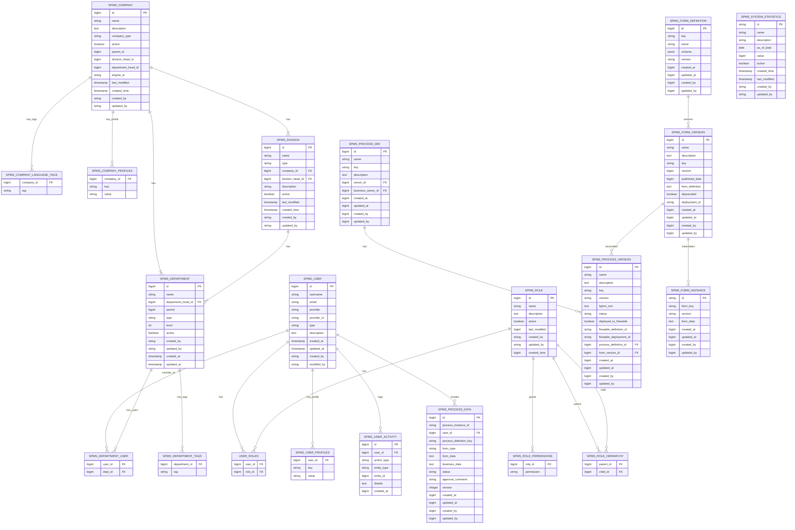

# Database Specification - Part 1

This section provides a detailed specification on how the data is organized in the SPMS (Smart Process Management System).

## 1. Database Design

This section specifies how the database is designed and provides guidelines for future modification.

### 1.1 Naming Convention

The SPMS database follows a consistent naming convention to ensure clarity and maintainability:

**Table Names:**
- All table names use the prefix `spms_` followed by the module and entity name
- Format: `spms_{module}_{entity}` (e.g., `spms_user`, `spms_project`)
- Use snake_case for multi-word table names (e.g., `spms_process_definition`)

**Column Names:**
- Use snake_case for all column names (e.g., `user_id`, `created_at`, `project_code`)
- Foreign key columns follow the pattern `{referenced_table}_id` (e.g., `user_id`, `project_id`)
- Boolean columns use `is_` prefix when appropriate (e.g., `is_active`)
- Timestamp columns use standardized names: `created_at`, `updated_at`, `last_modified`

**Index Names:**
- Primary key indexes: `pk_{table_name}`
- Foreign key indexes: `fk_{table_name}_{referenced_table}`
- Unique indexes: `uk_{table_name}_{column_name}`
- Regular indexes: `idx_{table_name}_{column_name}`

### 1.2 Storage Allocation

**Database Engine:** PostgreSQL 13+
**Character Set:** UTF-8 encoding for multi-language support
**Collation:** Default PostgreSQL collation with case-sensitive string comparisons

**Storage Strategy:**
- **JSONB Fields:** Used for flexible schema extension (`custom_fields`, `user_profiles`)
- **TEXT Fields:** For large text content (descriptions, BPMN XML, form definitions)
- **BIGINT:** For all ID fields to support large-scale deployments
- **Timestamp Storage:** Unix epoch milliseconds (BIGINT) for audit fields

### 1.3 Database Organization

The SPMS database is organized into three main modules:

1. **IDM (Identity Management) Module** - User, role, company, department management
2. **Process Management Module** - Workflow definition and execution
3. **System Management Module** - System statistics, user activity tracking

### 1.4 Information Required for Constructing Files/Tables/Dictionaries

**Audit Trail Requirements:**
- All tables inherit from either `BaseEntity` or `AuditableEntity`
- Mandatory fields: `id` (BIGSERIAL), `created_at`, `updated_at`, `created_by`, `updated_by`
- Soft delete support through `active` or `is_active` boolean fields

**Relationship Management:**
- Foreign key constraints enforced at database level
- Cascade delete rules defined based on business logic
- Many-to-many relationships use junction tables with composite primary keys

**Data Integrity:**
- Unique constraints on business keys (usernames, email addresses, project codes)
- Check constraints for enumerated values
- NOT NULL constraints on mandatory business fields

## 2. Detailed Description of File Structure/Table

# Database Diagram

---

## 3. IDM (Identity Management) Module Tables

### 3.1 spms_user

**Purpose:** Central user management table storing all system users including staff, vendors, and machine users.

**Content:** User authentication credentials, profile information, and provider integration details.

**Relationships:** 
- Many-to-many with `spms_role` through `user_roles` junction table
- Many-to-many with `spms_department` through `spms_department_user` junction table
- Referenced by various other tables as foreign key

**Table Specification:**

| Field Name | Description | Data Type | Size | Constraints | Validation Rules |
|------------|-------------|-----------|------|-------------|------------------|
| id | Primary key identifier | BIGSERIAL | 8 bytes | PRIMARY KEY, NOT NULL | Auto-increment |
| username | Unique username for authentication | VARCHAR | 255 | UNIQUE, NOT NULL | Must be unique across system |
| email | User email address | VARCHAR | 255 | UNIQUE, NOT NULL | Valid email format |
| provider | OAuth2 provider name | VARCHAR | 255 | NOT NULL | Valid provider identifier |
| provider_id | External provider user ID | VARCHAR | 255 | NULL | Provider-specific user ID |
| type | User type enumeration | VARCHAR | 20 | NOT NULL | STAFF, VENDOR, MACHINE |
| description | User description/notes | TEXT | Variable | NULL | Optional descriptive text |
| created_at | Creation timestamp | TIMESTAMP | 8 bytes | NOT NULL | Auto-set on insert |
| updated_at | Last update timestamp | TIMESTAMP | 8 bytes | NOT NULL | Auto-update on modification |
| created_by | User who created this record | VARCHAR | 255 | NULL | Reference to creating user |
| modified_by | User who last modified record | VARCHAR | 255 | NULL | Reference to modifying user |

**Indexes and Catalogues:**
- `pk_spms_user` (PRIMARY KEY on id) - Primary access pattern
- `uk_spms_user_username` (UNIQUE on username) - Authentication lookup
- `uk_spms_user_email` (UNIQUE on email) - Email-based lookup
- `idx_spms_user_provider` (INDEX on provider, provider_id) - OAuth integration
- `idx_spms_user_type` (INDEX on type) - User type filtering

**Junction Tables:**
- `spms_user_profiles`: Stores key-value profile data
- `user_roles`: Many-to-many relationship with roles

**Environmental Information:**
- **Physical Location:** Primary PostgreSQL instance
- **File Owner:** Database service account
- **Access Rights:** Read/Write for application service, Read-only for reporting
- **Backup Requirement:** Daily backup with 30-day retention
- **Estimated Growth:** 100-500 new users per month

### 3.2 spms_role

**Purpose:** Role-based access control (RBAC) system defining user permissions and role hierarchies.

**Content:** Role definitions, permissions, and hierarchical relationships for access control.

**Relationships:**
- Many-to-many with `spms_user` through `user_roles` junction table
- Self-referencing many-to-many for role hierarchy through `spms_role_hierarchy`

**Table Specification:**

| Field Name | Description | Data Type | Size | Constraints | Validation Rules |
|------------|-------------|-----------|------|-------------|------------------|
| id | Primary key identifier | BIGSERIAL | 8 bytes | PRIMARY KEY, NOT NULL | Auto-increment |
| name | Role name | VARCHAR | 255 | UNIQUE, NOT NULL | Unique role identifier |
| description | Role description | TEXT | Variable | NULL | Descriptive text |
| active | Role status | BOOLEAN | 1 byte | NULL | True if role is active |
| last_modified | Last modification time | BIGINT | 8 bytes | NULL | Unix timestamp |
| created_by | Creator user reference | VARCHAR | 255 | NULL | Reference to creating user |
| updated_by | Last modifier reference | VARCHAR | 255 | NULL | Reference to modifying user |
| created_time | Creation timestamp | BIGINT | 8 bytes | NULL | Unix timestamp |

**Indexes and Catalogues:**
- `pk_spms_role` (PRIMARY KEY on id) - Primary access pattern
- `uk_spms_role_name` (UNIQUE on name) - Role name lookup
- `idx_spms_role_active` (INDEX on active) - Active role filtering

**Junction Tables:**
- `spms_role_permissions`: Stores role permissions as string collection
- `spms_role_hierarchy`: Role parent-child relationships for inheritance

**Environmental Information:**
- **Physical Location:** Primary PostgreSQL instance
- **File Owner:** Database service account
- **Access Rights:** Read/Write for admin services, Read-only for application
- **Backup Requirement:** Daily backup with 30-day retention
- **Estimated Growth:** 5-10 new roles per year

### 3.3 spms_company

**Purpose:** Company/organization management with hierarchical structure support.

**Content:** Company information, organizational hierarchy, and workflow engine integration.

**Relationships:**
- Self-referencing for parent-child company relationships
- Referenced by divisions and departments

**Table Specification:**

| Field Name | Description | Data Type | Size | Constraints | Validation Rules |
|------------|-------------|-----------|------|-------------|------------------|
| id | Primary key identifier | BIGSERIAL | 8 bytes | PRIMARY KEY, NOT NULL | Auto-increment |
| name | Company name | VARCHAR | 255 | UNIQUE, NOT NULL | Unique company name |
| description | Company description | TEXT | Variable | NULL | Optional description |
| company_type | Company classification | VARCHAR | 50 | NOT NULL | Valid company type enum |
| active | Active status | BOOLEAN | 1 byte | NOT NULL, DEFAULT TRUE | Activity flag |
| parent_id | Parent company reference | BIGINT | 8 bytes | FOREIGN KEY | References spms_company(id) |
| division_head_id | Division head user ID | BIGINT | 8 bytes | NULL | References spms_user(id) |
| department_head_id | Department head user ID | BIGINT | 8 bytes | NULL | References spms_user(id) |
| engine_id | Flowable engine group ID | VARCHAR | 255 | NULL | Workflow engine identifier |
| last_modified | Last modification time | TIMESTAMP | 8 bytes | NULL | Auto-update timestamp |
| created_time | Creation timestamp | TIMESTAMP | 8 bytes | NULL | Auto-set timestamp |
| created_by | Creator reference | VARCHAR | 255 | NULL | Creating user |
| updated_by | Modifier reference | VARCHAR | 255 | NULL | Last modifying user |

**Indexes and Catalogues:**
- `pk_spms_company` (PRIMARY KEY on id) - Primary access pattern
- `uk_spms_company_name` (UNIQUE on name) - Company name lookup
- `fk_spms_company_parent` (FOREIGN KEY on parent_id) - Hierarchy navigation
- `idx_spms_company_active` (INDEX on active) - Active company filtering
- `idx_spms_company_type` (INDEX on company_type) - Type-based queries

**Junction Tables:**
- `spms_company_language_tags`: Multi-language support
- `spms_company_profiles`: Company profile attributes

**Environmental Information:**
- **Physical Location:** Primary PostgreSQL instance
- **File Owner:** Database service account
- **Access Rights:** Read/Write for admin services, Read-only for application
- **Backup Requirement:** Daily backup with 30-day retention
- **Estimated Growth:** 1-5 new companies per year

### 3.4 spms_department

**Purpose:** Department management within companies or divisions.

**Content:** Department organizational structure, user assignments, and hierarchy management.

**Relationships:**
- Many-to-many with `spms_user` through `spms_department_user`
- References `spms_user` for department head
- Hierarchical relationship through parent field

**Table Specification:**

| Field Name | Description | Data Type | Size | Constraints | Validation Rules |
|------------|-------------|-----------|------|-------------|------------------|
| id | Primary key identifier | BIGSERIAL | 8 bytes | PRIMARY KEY, NOT NULL | Auto-increment |
| name | Department name | VARCHAR | 255 | UNIQUE, NOT NULL | Unique department name |
| department_head_id | Department head user | BIGINT | 8 bytes | FOREIGN KEY | References spms_user(id) |
| parent | Parent entity ID | BIGINT | 8 bytes | NOT NULL | Company or division ID |
| type | Department type | VARCHAR | 50 | NOT NULL | COMPANY or DIVISION |
| level | Hierarchical level | INTEGER | 4 bytes | NOT NULL | Organizational level |
| active | Active status | BOOLEAN | 1 byte | NOT NULL, DEFAULT TRUE | Activity flag |
| created_by | Creator reference | VARCHAR | 255 | NULL | Creating user |
| updated_by | Modifier reference | VARCHAR | 255 | NULL | Modifying user |
| created_at | Creation timestamp | TIMESTAMP | 8 bytes | NULL | Auto-set timestamp |
| updated_at | Update timestamp | TIMESTAMP | 8 bytes | NULL | Auto-update timestamp |

**Indexes and Catalogues:**
- `pk_spms_department` (PRIMARY KEY on id) - Primary access pattern
- `uk_spms_department_name` (UNIQUE on name) - Department name lookup
- `fk_spms_department_head` (FOREIGN KEY on department_head_id) - Head lookup
- `idx_spms_department_parent` (INDEX on parent) - Hierarchy queries
- `idx_spms_department_type` (INDEX on type) - Type filtering
- `idx_spms_department_active` (INDEX on active) - Active filtering

**Junction Tables:**
- `spms_department_tags`: Department metadata tags
- `spms_department_user`: User-department relationships

**Environmental Information:**
- **Physical Location:** Primary PostgreSQL instance
- **File Owner:** Database service account
- **Access Rights:** Read/Write for HR services, Read-only for reporting
- **Backup Requirement:** Daily backup with 30-day retention
- **Estimated Growth:** 5-20 new departments per year

### 3.5 spms_division

**Purpose:** Division management as intermediate organizational level between companies and departments.

**Content:** Division organizational information, leadership assignments, and company relationships.

**Relationships:**
- References `spms_company` as parent organization
- References `spms_user` for division head

**Table Specification:**

| Field Name | Description | Data Type | Size | Constraints | Validation Rules |
|------------|-------------|-----------|------|-------------|------------------|
| id | Primary key identifier | BIGSERIAL | 8 bytes | PRIMARY KEY, NOT NULL | Auto-increment |
| name | Division name | VARCHAR | 100 | UNIQUE, NOT NULL | Unique division name |
| type | Division type | VARCHAR | 50 | NOT NULL | Division classification |
| company_id | Parent company | BIGINT | 8 bytes | FOREIGN KEY, NOT NULL | References spms_company(id) |
| division_head_id | Division head user | BIGINT | 8 bytes | FOREIGN KEY | References spms_user(id) |
| description | Division description | VARCHAR | 500 | NULL | Optional description |
| active | Active status | BOOLEAN | 1 byte | NOT NULL, DEFAULT TRUE | Activity flag |
| last_modified | Last modification time | TIMESTAMP | 8 bytes | NULL | Auto-update timestamp |
| created_time | Creation timestamp | TIMESTAMP | 8 bytes | NULL | Auto-set timestamp |
| created_by | Creator reference | VARCHAR | 255 | NULL | Creating user |
| updated_by | Modifier reference | VARCHAR | 255 | NULL | Modifying user |

**Indexes and Catalogues:**
- `pk_spms_division` (PRIMARY KEY on id) - Primary access pattern
- `uk_spms_division_name` (UNIQUE on name) - Division name lookup
- `fk_spms_division_company` (FOREIGN KEY on company_id) - Company relationship
- `fk_spms_division_head` (FOREIGN KEY on division_head_id) - Head lookup
- `idx_spms_division_type` (INDEX on type) - Type filtering
- `idx_spms_division_active` (INDEX on active) - Active filtering

**Environmental Information:**
- **Physical Location:** Primary PostgreSQL instance
- **File Owner:** Database service account
- **Access Rights:** Read/Write for admin services, Read-only for reporting
- **Backup Requirement:** Daily backup with 30-day retention
- **Estimated Growth:** 2-10 new divisions per year

# Database Specification - Part 2

*This is Part 2 of the Database Specification, covering Project Management, Process Management, and System Management modules.*

---

---

## 5. Process Management Module Tables

### 5.1 spms_process_def

**Purpose:** Process definition management storing workflow templates and metadata.

**Content:** High-level process definitions serving as templates for versioned processes.

**Relationships:**
- References `spms_user` for owner and business owner
- One-to-many with `spms_process_version` for version management

**Table Specification:**

| Field Name | Description | Data Type | Size | Constraints | Validation Rules |
|------------|-------------|-----------|------|-------------|------------------|
| id | Primary key identifier | BIGSERIAL | 8 bytes | PRIMARY KEY, NOT NULL | Auto-increment |
| name | Process definition name | VARCHAR | 255 | NOT NULL | Required process name |
| key | Unique process key | VARCHAR | 255 | NOT NULL | Unique business identifier |
| description | Process description | TEXT | Variable | NULL | Optional description |
| owner_id | Process owner user ID | BIGINT | 8 bytes | NULL | References spms_user(id) |
| business_owner_id | Business owner user ID | BIGINT | 8 bytes | NULL | References spms_user(id) |
| created_at | Creation timestamp | BIGINT | 8 bytes | NOT NULL | Unix timestamp |
| updated_at | Update timestamp | BIGINT | 8 bytes | NOT NULL | Unix timestamp |
| created_by | Creator user ID | BIGINT | 8 bytes | NOT NULL | References spms_user(id) |
| updated_by | Modifier user ID | BIGINT | 8 bytes | NOT NULL | References spms_user(id) |

**Indexes and Catalogues:**
- `pk_spms_process_def` (PRIMARY KEY on id) - Primary access pattern
- `uk_spms_process_def_key` (UNIQUE on key) - Business key lookup
- `idx_spms_process_def_name` (INDEX on name) - Name-based searches
- `fk_spms_process_def_owner` (FOREIGN KEY on owner_id) - Owner queries
- `fk_spms_process_def_business_owner` (FOREIGN KEY on business_owner_id) - Business owner queries

**Environmental Information:**
- **Physical Location:** Primary PostgreSQL instance
- **Access Rights:** Read/Write for process admin, Read-only for process users
- **Backup Requirement:** Daily backup with 30-day retention
- **Estimated Growth:** 10-50 new process definitions per year

### 5.2 spms_process_version

**Purpose:** Version management for process definitions with BPMN XML storage and Flowable integration.

**Content:** Versioned BPMN process definitions with deployment status and Flowable integration details.

**Relationships:**
- References `spms_process_def` as parent process definition
- References `spms_form_version` for associated forms

**Table Specification:**

| Field Name | Description | Data Type | Size | Constraints | Validation Rules |
|------------|-------------|-----------|------|-------------|------------------|
| id | Primary key identifier | BIGSERIAL | 8 bytes | PRIMARY KEY, NOT NULL | Auto-increment |
| name | Version name | VARCHAR | 255 | NOT NULL | Version display name |
| description | Version description | TEXT | Variable | NULL | Optional description |
| key | Process version key | VARCHAR | 255 | NOT NULL | Business key |
| version | Semantic version | VARCHAR | 50 | NOT NULL | Version number (e.g., 1.0.0) |
| bpmn_xml | BPMN process definition | TEXT | Variable | NOT NULL | BPMN 2.0 XML content |
| status | Version status | VARCHAR | 50 | NOT NULL | DRAFT, PUBLISHED, DEPRECATED |
| deployed_to_flowable | Deployment status | BOOLEAN | 1 byte | NOT NULL, DEFAULT FALSE | Flowable deployment flag |
| flowable_definition_id | Flowable internal ID | VARCHAR | 255 | NULL | Flowable process definition ID |
| flowable_deployment_id | Flowable deployment ID | VARCHAR | 255 | NULL | Flowable deployment reference |
| process_definition_id | Parent process definition | BIGINT | 8 bytes | FOREIGN KEY | References spms_process_def(id) |
| form_version_id | Associated form version | BIGINT | 8 bytes | FOREIGN KEY | References spms_form_version(id) |
| created_at | Creation timestamp | BIGINT | 8 bytes | NOT NULL | Unix timestamp |
| updated_at | Update timestamp | BIGINT | 8 bytes | NOT NULL | Unix timestamp |
| created_by | Creator user ID | BIGINT | 8 bytes | NOT NULL | References spms_user(id) |
| updated_by | Modifier user ID | BIGINT | 8 bytes | NOT NULL | References spms_user(id) |

**Indexes and Catalogues:**
- `pk_spms_process_version` (PRIMARY KEY on id) - Primary access pattern
- `spms_uk_process_version_key_version` (UNIQUE on key, version) - Version uniqueness
- `fk_spms_process_version_def` (FOREIGN KEY on process_definition_id) - Definition relationship
- `fk_spms_process_version_form` (FOREIGN KEY on form_version_id) - Form relationship
- `idx_spms_process_version_status` (INDEX on status) - Status filtering
- `idx_spms_process_version_deployed` (INDEX on deployed_to_flowable) - Deployment status

**Environmental Information:**
- **Physical Location:** Primary PostgreSQL instance
- **Access Rights:** Read/Write for process admin, Read-only for process users
- **Backup Requirement:** Daily backup with 30-day retention
- **File Size:** 10KB-1MB per BPMN definition
- **Estimated Growth:** 50-200 new versions per year

### 5.3 spms_form_definition

**Purpose:** Form definition templates with schema storage for process forms.

**Content:** Form templates with JSON schema definitions for process user interfaces.

**Relationships:**
- Referenced by form versions for version control

**Table Specification:**

| Field Name | Description | Data Type | Size | Constraints | Validation Rules |
|------------|-------------|-----------|------|-------------|------------------|
| id | Primary key identifier | BIGSERIAL | 8 bytes | PRIMARY KEY, NOT NULL | Auto-increment |
| key | Unique form key | VARCHAR | 255 | UNIQUE, NOT NULL | Unique business identifier |
| name | Form display name | VARCHAR | 255 | NOT NULL | Required form name |
| schema | Form schema definition | JSONB | Variable | NULL | JSON schema structure |
| version | Form version | VARCHAR | 50 | NOT NULL | Version identifier |
| created_at | Creation timestamp | BIGINT | 8 bytes | NOT NULL | Unix timestamp |
| updated_at | Update timestamp | BIGINT | 8 bytes | NOT NULL | Unix timestamp |
| created_by | Creator user ID | BIGINT | 8 bytes | NOT NULL | References spms_user(id) |
| updated_by | Modifier user ID | BIGINT | 8 bytes | NOT NULL | References spms_user(id) |

**Indexes and Catalogues:**
- `pk_spms_form_definition` (PRIMARY KEY on id) - Primary access pattern
- `uk_spms_form_definition_key` (UNIQUE on key) - Business key lookup
- `idx_spms_form_definition_name` (INDEX on name) - Name-based searches
- `idx_spms_form_definition_version` (INDEX on version) - Version queries

### 5.4 spms_form_version

**Purpose:** Version control for form definitions with publication and deprecation support.

**Content:** Versioned form definitions with deployment metadata and deprecation flags.

**Relationships:**
- Referenced by process versions for form association

**Table Specification:**

| Field Name | Description | Data Type | Size | Constraints | Validation Rules |
|------------|-------------|-----------|------|-------------|------------------|
| id | Primary key identifier | BIGSERIAL | 8 bytes | PRIMARY KEY, NOT NULL | Auto-increment |
| name | Version name | VARCHAR | 255 | NULL | Version display name |
| description | Version description | TEXT | Variable | NULL | Optional description |
| key | Form key | VARCHAR | 255 | NOT NULL | Business key reference |
| version | Version number | BIGINT | 8 bytes | NOT NULL | Incremental version |
| published_date | Publication timestamp | BIGINT | 8 bytes | NOT NULL | Unix timestamp |
| form_definition | Form definition content | TEXT | Variable | NULL | JSON form definition |
| deprecated | Deprecation flag | BOOLEAN | 1 byte | NOT NULL, NOT UPDATABLE | Immutable deprecation status |
| deployment_id | Deployment identifier | VARCHAR | 255 | NULL | Deployment reference |
| created_at | Creation timestamp | BIGINT | 8 bytes | NOT NULL | Unix timestamp |
| updated_at | Update timestamp | BIGINT | 8 bytes | NOT NULL | Unix timestamp |
| created_by | Creator user ID | BIGINT | 8 bytes | NOT NULL | References spms_user(id) |
| updated_by | Modifier user ID | BIGINT | 8 bytes | NOT NULL | References spms_user(id) |

**Indexes and Catalogues:**
- `pk_spms_form_version` (PRIMARY KEY on id) - Primary access pattern
- `spms_uq_form_version_key` (UNIQUE on key, version) - Version uniqueness
- `idx_spms_form_version_published` (INDEX on published_date) - Publication date queries
- `idx_spms_form_version_deprecated` (INDEX on deprecated) - Deprecation filtering

### 5.5 spms_form_instance

**Purpose:** Form instance data storage for process execution and user submissions.

**Content:** User-submitted form data associated with specific form versions and process instances.

**Relationships:**
- References form versions through form_key and version
- Used by process instances for form data storage

**Table Specification:**

| Field Name | Description | Data Type | Size | Constraints | Validation Rules |
|------------|-------------|-----------|------|-------------|------------------|
| id | Primary key identifier | VARCHAR | 255 | PRIMARY KEY, NOT NULL | UUID identifier |
| form_key | Form definition key | VARCHAR | 255 | NOT NULL | References form version |
| version | Form version number | VARCHAR | 50 | NOT NULL | Version reference |
| form_data | User-submitted data | TEXT | Variable | NULL | JSON formatted data |
| created_at | Creation timestamp | BIGINT | 8 bytes | NOT NULL | Unix timestamp |
| updated_at | Update timestamp | BIGINT | 8 bytes | NULL | Unix timestamp |
| created_by | Creator user ID | BIGINT | 8 bytes | NOT NULL | References spms_user(id) |
| updated_by | Modifier user ID | BIGINT | 8 bytes | NOT NULL | References spms_user(id) |

**Indexes and Catalogues:**
- `pk_spms_form_instance` (PRIMARY KEY on id) - Primary access pattern
- `idx_spms_form_instance_key` (INDEX on form_key) - Form key queries
- `idx_spms_form_instance_version` (INDEX on version) - Version filtering
- `idx_spms_form_instance_created` (INDEX on created_at) - Time-based queries

---

## 6. System Management Module Tables

### 6.1 spms_system_statistics

**Purpose:** System metrics and statistics collection for monitoring and reporting.

**Content:** Time-series system statistics with configurable data points and retention policies.

**Relationships:**
- Standalone table with audit fields for statistics tracking

**Table Specification:**

| Field Name | Description | Data Type | Size | Constraints | Validation Rules |
|------------|-------------|-----------|------|-------------|------------------|
| id | Primary key identifier | VARCHAR | 255 | PRIMARY KEY, NOT NULL | UUID identifier |
| name | Statistic name | VARCHAR | 255 | NOT NULL | Statistic identifier |
| description | Statistic description | VARCHAR | 500 | NULL | Optional description |
| as_of_date | Statistics date | DATE | 4 bytes | NOT NULL | Data collection date |
| value | Statistic value | BIGINT | 8 bytes | NOT NULL | Numeric statistic value |
| active | Active status | BOOLEAN | 1 byte | NOT NULL, DEFAULT TRUE | Activity flag |
| created_time | Creation timestamp | TIMESTAMP | 8 bytes | NOT NULL | Auto-set timestamp |
| last_modified | Modification timestamp | TIMESTAMP | 8 bytes | NULL | Auto-update timestamp |
| created_by | Creator reference | VARCHAR | 255 | NOT NULL | Creating user |
| updated_by | Modifier reference | VARCHAR | 255 | NULL | Modifying user |

**Indexes and Catalogues:**
- `pk_spms_system_statistics` (PRIMARY KEY on id) - Primary access pattern
- `idx_spms_sys_stats_name` (INDEX on name) - Name-based queries
- `idx_spms_sys_stats_date` (INDEX on as_of_date) - Date range queries
- `idx_spms_sys_stats_name_date` (INDEX on name, as_of_date) - Combined queries
- `idx_spms_sys_stats_active` (INDEX on active) - Active statistics filtering

**Environmental Information:**
- **Physical Location:** Primary PostgreSQL instance
- **Access Rights:** Read/Write for system services, Read-only for reporting
- **Backup Requirement:** Daily backup with 1-year retention
- **Estimated Growth:** 100-1000 records per day

### 6.2 spms_user_activity

**Purpose:** User activity tracking and audit logging for system monitoring and compliance.

**Content:** User action logs with entity references and detailed activity information.

**Relationships:**
- References `spms_user` for activity tracking
- Contains entity references for audit trails

**Table Specification:**

| Field Name | Description | Data Type | Size | Constraints | Validation Rules |
|------------|-------------|-----------|------|-------------|------------------|
| id | Primary key identifier | BIGSERIAL | 8 bytes | PRIMARY KEY, NOT NULL | Auto-increment |
| user_id | Acting user ID | BIGINT | 8 bytes | NOT NULL | References spms_user(id) |
| action_type | Action type classification | VARCHAR | 100 | NOT NULL | Action categorization |
| entity_type | Target entity type | VARCHAR | 100 | NULL | Entity classification |
| entity_id | Target entity ID | BIGINT | 8 bytes | NULL | Entity reference |
| details | Activity details | TEXT | Variable | NULL | JSON formatted details |
| created_at | Activity timestamp | BIGINT | 8 bytes | NOT NULL | Unix timestamp |

**Indexes and Catalogues:**
- `pk_spms_user_activity` (PRIMARY KEY on id) - Primary access pattern
- `idx_spms_user_activity_user` (INDEX on user_id) - User-based queries
- `idx_spms_user_activity_action` (INDEX on action_type) - Action filtering
- `idx_spms_user_activity_entity` (INDEX on entity_type, entity_id) - Entity tracking
- `idx_spms_user_activity_time` (INDEX on created_at) - Time-based queries
- `idx_spms_user_activity_user_time` (INDEX on user_id, created_at) - User timeline

**Environmental Information:**
- **Physical Location:** Primary PostgreSQL instance
- **Access Rights:** Write for all services, Read for audit and reporting
- **Backup Requirement:** Daily backup with 7-year retention (compliance)
- **File Size:** High growth table, estimated 10GB per year
- **Estimated Growth:** 10,000-100,000 records per day

---

## 7. Environmental Specific Information Summary

### 7.1 Physical Location and Logical Assignment

**Primary Database Server:**
- **Location:** PostgreSQL 13+ primary instance
- **Logical Assignment:** Production SPMS database cluster
- **High Availability:** Master-slave configuration with automatic failover

**Backup Storage:**
- **Location:** Separate backup storage infrastructure
- **Retention Policies:** Varying by table based on compliance requirements
- **Recovery Point Objective (RPO):** 1 hour maximum data loss
- **Recovery Time Objective (RTO):** 4 hours maximum downtime

### 7.2 Access Rights and Security

**Service Accounts:**
- **Application Service:** Read/Write access to all application tables
- **Reporting Service:** Read-only access to all tables
- **Admin Service:** Full DDL and DML access for schema management
- **Backup Service:** Read access for backup operations

**User Access:**
- **Database Administrators:** Full administrative access
- **Application Developers:** DDL access to development schemas only
- **Business Users:** No direct database access (application-mediated only)

### 7.3 Backup and Archive Requirements

**Critical Business Data (7-year retention):**
- `spms_user_activity` - Audit compliance
- `spms_system_statistics` - Business metrics

**Standard Business Data (30-day retention):**
- All IDM module tables
- Process definition tables

**Temporary Data (Daily cleanup):**
- Process instance data - Completed instances older than 1 year

### 7.4 Performance and Growth Estimates

**High Volume Tables:**
- `spms_user_activity`: 10GB+ per year
- `spms_system_statistics`: 500MB per year

**Medium Volume Tables:**
- Process and form tables: 200MB per year

**Low Volume Tables:**
- IDM tables: 50MB per year

### 7.5 Platform Specific Information

**PostgreSQL Specific Features:**
- **JSONB Support:** Extensive use for flexible schema extension
- **Full Text Search:** Available for text fields in process and form tables
- **Partitioning:** Recommended for high-volume tables (`spms_user_activity`, `spms_system_statistics`)
- **Connection Pooling:** Required for high-concurrency access patterns

**Monitoring and Maintenance:**
- **Query Performance:** Regular analysis of slow query logs
- **Index Maintenance:** Monthly index rebuilding for high-volume tables
- **Statistics Updates:** Weekly ANALYZE operations
- **Vacuum Operations:** Daily vacuum for high-transaction tables

---

*This concludes the Database Specification for the SPMS system, covering all active tables used by the backend implementation. The specification excludes deprecated tables such as `spms_timecard_entry` and `spms_process_data` that are no longer referenced in the codebase.*
