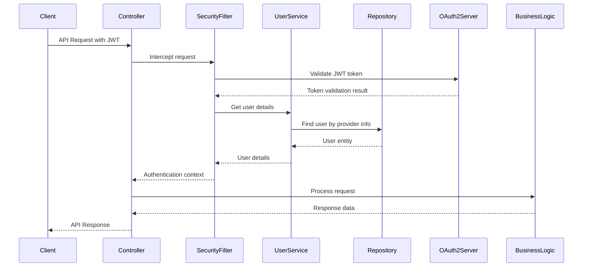
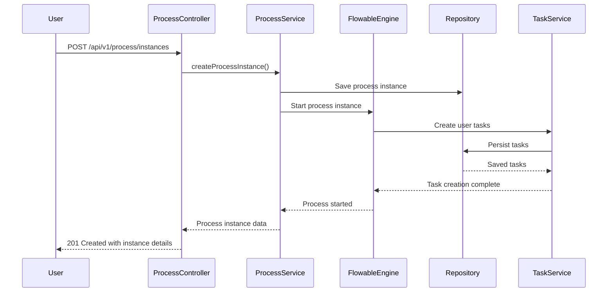
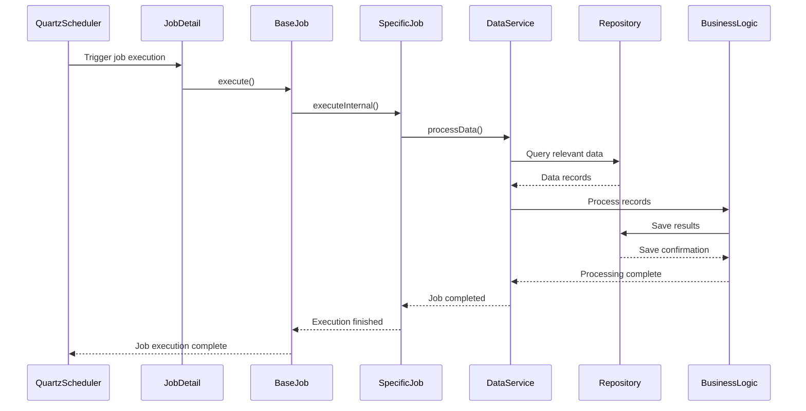

# Project Brief: Backend Structure

## System Overview

The SPMS (Smart Process Management System) backend is a comprehensive Spring Boot application designed to manage identity, processes, projects, and system operations. It follows a modular architecture with clear separation of concerns, utilizing modern Java frameworks including Spring Security, Spring Data JPA, Flowable BPMN engine, and Quartz scheduling. The system focuses on core business process management with identity management, project tracking, and system administration capabilities.

### Key Technologies
- **Framework**: Spring Boot 3.4.5
- **Database**: PostgreSQL with Flyway migrations
- **Workflow Engine**: Flowable 7.1.0
- **Security**: Spring Security OAuth2 with JOSE
- **Scheduling**: Spring Quartz
- **API Documentation**: Springdoc OpenAPI
- **Templating**: FreeMarker
- **Real-time**: WebSocket support

## Package Architecture

### config
Configuration classes that bootstrap and configure the application:
- `SecurityConfig`: OAuth2 resource server configuration with JWT authentication
- `WebConfig`: CORS, interceptors, and web-specific settings
- `QuartzConfig`: Job scheduling and trigger management
- `OpenApiConfig`: Swagger/OpenAPI documentation setup
- `WebSocketConfig`: Real-time communication configuration
- `AutowiringSpringBeanJobFactory`: Quartz job autowiring support

### controller
REST API endpoints organized by domain:
- **idm**: Identity Management (Users, Roles, Companies, Departments, Divisions)
- **process**: BPMN process definition and instance management
- **project**: Project and Task management
- **sys**: System operations, jobs, and statistics
- **dto**: Data Transfer Objects for request/response formatting
- **exception**: Global exception handling and error responses

### service
Core business logic implementation:
- **idm**: User management, role assignment, organizational hierarchy
- **process**: Form management, process deployment, task execution
- **project**: Project and task management
- **sys**: System statistics, job management, integration configs
- **model**: Domain models and business objects
- **exception**: Service-layer exception definitions

### repository
Data access layer with JPA repositories:
- **entities**: JPA entity definitions with auditing support
- **idm**: User, Role, Company, Department, Division repositories
- **process**: Process definition, instance, and form repositories
- **project**: Task and Project repositories
- **sys**: System statistics and user activity tracking

### jobs
Scheduled and background task management:
- `CleanupJob`: System maintenance and data cleanup
- `DataProcessingJob`: Batch data processing operations
- `ReportGenerationJob`: Automated report generation
- **data**: Data point collectors for system statistics

## Key Workflows and Sequence Diagrams

### User Authentication Flow

### Process Initiation Flow

### Scheduled Job Execution Flow

## Database Schema Overview

### Identity Management Entities
- `User`: User profiles with authentication details and department associations
- `Role`: System roles and permissions with hierarchical relationships
- `Company`: Organization hierarchy with parent/child company structure
- `Division`: Business divisions within companies
- `Department`: Functional and local departments with user assignments

### Process Management Entities
- `ProcessDefinition`: BPMN process definitions with version history
- `ProcessInstance`: Running process instances
- `ProcessVersion`: Version history of processes with BPMN XML
- `FormDefinition`: Dynamic form configurations with JSON schema
- `FormInstance`: Submitted form data
- `FormVersion`: Versioned form definitions
- `ProcessData`: Process-related data storage
- `BusinessKeyEntities`: Business key management for processes
- `IntegrationConfig`: External service integration configurations

### Project Management Entities
- `ProjectEntity`: Project definitions and metadata with custom fields
- `TaskEntity`: Project tasks and assignments

### System Entities
- `SystemStatistics`: System performance metrics
- `SystemConfig`: System configuration settings with versioning
- `SystemConfigHistory`: History of configuration changes
- `JobHistory`: Scheduled job execution records
- `MenuEntity`: System menu configurations
- `ThemeEntity`: UI theme configurations
- `UserActivity`: Audit trail of user actions

## API Endpoint Summary

### Identity Management (/api/v1)
- `GET /users`: Search and list users
- `POST /users`: Create new user
- `PUT /users/{id}`: Update user profile
- `DELETE /users/{id}`: Delete user
- `GET /users/search`: Search users with query
- `POST /users/{userId}/roles/{roleId}`: Assign role to user
- `DELETE /users/{userId}/roles/{roleId}`: Remove role from user
- `GET /companies`: Manage organizational structure
- `POST /companies`: Create new company
- `PUT /companies/{id}`: Update company
- `DELETE /companies/{id}`: Delete company
- `POST /companies/{id}/children`: Add child companies
- `GET /companies/{id}/children`: Get child companies
- `GET /companies/valid-parents`: Get valid parent companies by type
- `GET /companies/{id}/organization-chart`: Generate organization chart
- `GET /departments`: List departments
- `POST /departments`: Create department
- `PUT /departments/{id}`: Update department
- `POST /departments/{departmentId}/users`: Add users to department
- `DELETE /departments/{departmentId}/users`: Remove users from department
- `GET /divisions`: List divisions
- `POST /divisions`: Create division
- `PUT /divisions/{id}`: Update division
- `DELETE /divisions/{id}`: Delete division
- `DELETE /divisions/bulk`: Bulk delete divisions
- `GET /roles`: List roles
- `POST /roles`: Create role
- `GET /roles/{id}`: Get role
- `PUT /roles/{id}`: Update role
- `DELETE /roles/{id}`: Delete role
- `POST /roles/{id}/permissions`: Add permission to role
- `DELETE /roles/{id}/permissions`: Remove permission from role
- `GET /roles/{id}/permissions`: Get role permissions
- `POST /roles/{id}/parents`: Add parent role
- `DELETE /roles/{id}/parents`: Remove parent role
- `GET /roles/search`: Search roles by name or description

### Process Management (/api/v1/process)
- `GET /definitions`: List process definitions
- `POST /definitions`: Create new process definition
- `GET /definitions/{definitionId}`: Get process definition
- `GET /definitions/search`: Search process definitions
- `POST /definitions/{definitionId}/versions`: Create process definition version
- `GET /definitions/{definitionId}/versions`: List process definition versions
- `GET /definitions/{definitionId}/versions/{version}`: Get process definition version
- `PUT /definitions/{definitionId}/versions/{versionId}`: Update process definition version
- `POST /definitions/{definitionId}/versions/{versionId}/active`: Activate process version
- `DELETE /definitions/{definitionId}/versions/{versionId}/active`: Deactivate process version
- `GET /definitions/deployments/{deploymentId}`: Get process version by deployment ID
- `GET /forms`: Get all form keys
- `POST /forms/{key}/versions`: Create new form version
- `GET /forms/{key}/versions/latest`: Get latest form version
- `GET /forms/{key}/versions/{version}`: Get specific form version
- `GET /forms/{key}/versions`: List all form versions
- `POST /forms/{key}/versions/{version}/deprecate`: Deprecate form version
- `POST /forms-instance`: Create form instance
- `GET /forms-instance/{id}`: Get form instance
- `PUT /forms-instance/{id}`: Update form instance
- `DELETE /forms-instance/{id}`: Delete form instance
- `GET /forms-instance/form/{formKey}`: List form instances by form key
- `GET /forms-instance/form/{formKey}/version/{version}`: List form instances by form key and version
- `POST /process-instances`: Start process instance
- `GET /process-instances/{instanceId}`: Get process instance status
- `GET /process-instances/{instanceId}/tasks`: Get process instance tasks
- `GET /process-instances/{instanceId}/activities`: Get process instance activities
- `GET /process-instances/stats/incomplete-tasks`: Count incomplete tasks
- `GET /process-instances/stats/completed-tasks`: Count completed tasks
- `GET /process-instances/stats/running-processes`: Count running processes
- `POST /process-instances/{instanceId}/tasks/{taskId}/reject`: Reject task
- `POST /process-instances/{instanceId}/tasks/{taskId}/complete`: Complete task
- `GET /process-instances`: List all process instances
- `GET /process-instances/user`: List user-related process instances

### Project Management (/api/v1/project)
- `GET /projects`: List projects
- `POST /projects`: Create project
- `GET /projects/{id}`: Get project by ID
- `GET /projects/code/{code}`: Get project by code
- `PUT /projects/{id}`: Update project
- `DELETE /projects/{id}`: Delete project
- `GET /projects/status/{status}`: Get projects by status
- `GET /projects/manager/{managerId}`: Get projects by manager
- `GET /projects/search`: Search projects
- `GET /projects/options`: Get active project options
- `GET /projects/exists/{code}`: Check project code exists
- `GET /tasks`: List tasks
- `POST /tasks`: Create task
- `GET /tasks/{id}`: Get task by ID
- `GET /tasks/number/{number}`: Get task by number
- `PUT /tasks/{id}`: Update task
- `DELETE /tasks/{id}`: Delete task
- `GET /tasks/project/{projectId}`: Get tasks by project ID
- `GET /tasks/project/code/{projectCode}`: Get tasks by project code
- `GET /tasks/search`: Search tasks by name
- `GET /tasks/project/{projectId}/options`: Get task options by project
- `GET /tasks/exists/{number}`: Check task number exists
- `GET /tasks/project/{projectId}/count`: Get task count by project

### System Management (/api/v1/sys)
- `GET /jobs`: Job management and monitoring
- `GET /statistics`: System performance metrics
- `POST /config`: System configuration
- `POST /jobs/schedule`: Schedule job
- `POST /jobs/trigger/{jobName}`: Trigger job
- `GET /jobs/status/{jobName}`: Get job status
- `GET /jobs/history/{jobName}`: Get job history
- `DELETE /jobs/{jobName}`: Delete job

## Security Architecture

### Authentication
- OAuth2 Resource Server with JWT tokens
- JOSE library for JWT validation
- Provider-based user linking (OAuth2 clients)
- Role-based access control

### Authorization
- Method-level security with `@PreAuthorize`
- Role-based endpoint access
- Permission-based service methods
- Organizational scope restrictions

### Data Protection
- JPA auditing with createdBy/modifiedBy
- Encryption for sensitive data
- Audit trails for critical operations
- Input validation and sanitization

## Deployment & Configuration

### Environment Setup
- PostgreSQL database with Flyway migrations
- OAuth2 authorization server configuration
- Flowable engine database setup
- Quartz job store configuration

### Configuration Files
- `application.properties`: Main configuration
- `system-config.json`: System-specific settings
- Flyway migration scripts in `db/migration/`
- BPMN process definitions in `processes/`

### Monitoring & Operations
- Spring Boot Actuator endpoints
- Custom statistics collection
- Job execution monitoring
- User activity tracking

## Development Practices

### Testing Strategy
- Unit tests for services and utilities
- Integration tests for controllers
- Flowable process testing
- Security testing with Spring Security Test

### Code Quality
- Lombok for boilerplate reduction
- Consistent exception handling
- Comprehensive logging
- API documentation with OpenAPI

### Deployment Pipeline
- Maven-based build system
- Docker containerization ready
- Database migration automation
- Configuration management

---

*This document provides a comprehensive overview of the SPMS backend architecture, key workflows, and implementation details. For specific implementation questions, refer to the source code and API documentation.*
