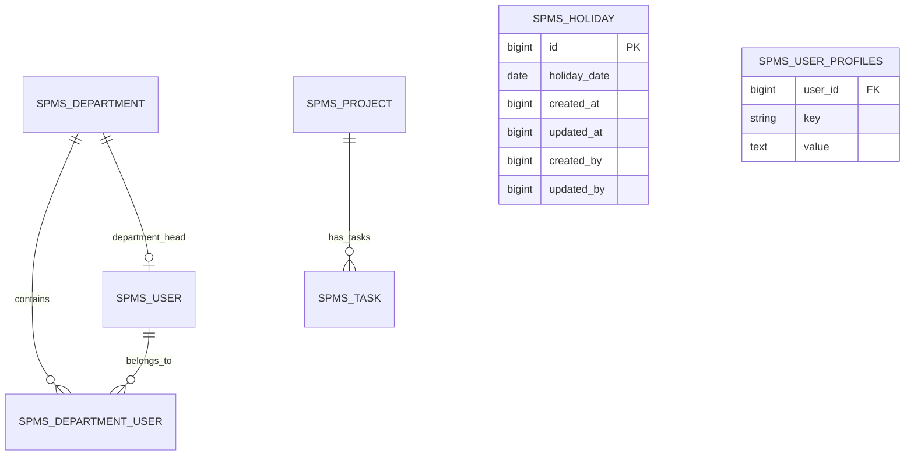

<!-- b6f363e8-46d3-4aee-8f41-550f4cca80ab b3f4c7a2-dfa4-4dc0-a7c1-677ae372f2a7 -->
# Timecard 后端开发详细规格说明书

## 1. 概述

本规格说明书定义 SPMS Timecard 模块后端 API 的完整开发需求，用于替换前端 mockData，提供真实的数据服务。后端将利用现有的 Flowable 流程引擎、Security 认证和数据库表结构，新增 Timecard 专用的业务逻辑和 Holiday 管理功能。

### 1.1 开发范围

**包含：**

- Timecard 员工信息 API（基于 SecurityContext 获取当前用户）
- 项目/任务查询 API（利用现有 `spms_project` 和 `spms_task` 表）
- 节假日管理 API（新建 `spms_holiday` 表）
- 项目/任务/节假日的 Excel 导入导出
- 与现有 Flowable 审批流程集成

**不包含：**

- 报表生成功能（后续迭代）
- BPMN 流程设计（使用现有审批流）

### 1.2 技术栈

- Spring Boot 3.4.5
- PostgreSQL + Flyway
- Flowable 7.1.0
- Apache POI（Excel 导入导出）
- Spring Security OAuth2
- 现有 CORS 配置（已支持 `http://localhost:5173`）

---

## 2. 数据库设计

### 2.1 使用现有的 spms_holiday 表

**现有表结构：**

```sql
-- spms_holiday 表已存在，无需创建
CREATE TABLE spms_holiday (
    id BIGINT NOT NULL,
    holiday_date DATE NOT NULL,
    created_at BIGINT NOT NULL,
    updated_at BIGINT NOT NULL,
    created_by BIGINT NOT NULL,
    updated_by BIGINT NOT NULL
);
```

**字段说明：**

- `id`: 主键
- `holiday_date`: 节假日日期（YYYY-MM-DD）
- `created_at`: 创建时间戳
- `updated_at`: 更新时间戳
- `created_by`: 创建人 User ID
- `updated_by`: 更新人 User ID

**业务逻辑：**

- 前端传入具体日期查询是否为节假日
- 如果日期在 `spms_holiday` 表中存在，则将该日期的背景显示为绿色
- 不需要国家、名称、类型等额外信息

### 2.2 使用现有的用户相关表

**spms_user_profiles 表结构：**

```sql
-- 用户配置表，存储员工的中英文姓名等信息
CREATE TABLE spms_user_profiles (
    user_id BIGINT NOT NULL,
    key VARCHAR(255) NOT NULL,
    value TEXT NOT NULL
);
```

**示例数据：**

```
user_id | key            | value
--------|----------------|----------
4       | Chinese Name   | 张三
4       | English Name   | zhangsan
```

**数据关联说明：**

- `spms_user`: 用户基本信息表
- `spms_user_profiles`: 用户配置表（通过 `user_id` 关联）
- `spms_department`: 部门表
- `spms_department_user`: 用户部门关系表（通过 `user_id` 和 `department_id` 关联）
- 现有数据已足够满足 employee information 的所有需求，无需扩展表结构

---

## 3. API 端点设计

### 3.1 Timecard 员工信息 API

#### 3.1.1 获取当前用户的 Timecard 员工信息

**端点：** `GET /api/v1/timecard/staff-info`

**描述：** 获取当前登录用户的员工信息，用于 Timecard 表单自动填充

**认证：** 必须（通过 SecurityContext 获取）

**请求参数：** 无

**响应示例：**

```json
{
  "staffId": "EMP001",
  "staffNameChinese": "张伟",
  "staffNameEnglish": "Wei Zhang",
  "team": "IT Development",
  "staffType": "Permanent",
  "departmentHead": "John Smith",
  "finalApproval": "Sarah Johnson",
  "timecardMonth": "2025-11"
}
```

**业务逻辑：**

1. 通过 `userService.getCurrentUserId()` 获取当前用户 ID
2. 查询 `spms_user` 表获取用户基本信息
3. 从 `user_profiles` JSONB 字段提取 `staffNameChinese`, `staffNameEnglish`, `staffType`
4. 查询用户的 LOCAL 类型部门作为 `team`
5. 从部门的 `department_head` 获取 `departmentHead` 姓名
6. 从部门的 `tags` 中获取 `functionalManager` 作为 `finalApproval`
7. `timecardMonth` 设置为当前年月（格式：YYYY-MM）

**字段映射：**

```
staffId           -> user.id (转为字符串)
staffNameChinese  -> 从 spms_user_profiles 查询 key='Chinese Name' 的 value
staffNameEnglish  -> 从 spms_user_profiles 查询 key='English Name' 的 value
team              -> 从 spms_department_user 关联查询用户的 LOCAL 类型部门名称
staffType         -> user.type (STAFF, VENDOR, MACHINE)
departmentHead    -> 从 spms_department 查询部门的 department_head_id 对应的用户名
finalApproval     -> 从 spms_department 查询用户的 FUNCTIONAL 类型部门的 department_head_id 对应的用户名
timecardMonth     -> LocalDate.now().format("yyyy-MM")
```

**查询逻辑说明：**

1. 通过 `userService.getCurrentUserId()` 获取当前用户 ID
2. 查询 `spms_user` 表获取用户基本信息
3. 查询 `spms_user_profiles` 表，`user_id = 当前用户ID AND key IN ('Chinese Name', 'English Name')` 获取中英文姓名
4. 查询 `spms_department_user` 表关联 `spms_department` 表，筛选 `type = 'LOCAL'` 获取本地部门信息
5. 从本地部门的 `department_head_id` 查询部门负责人姓名
6. 查询用户的 `FUNCTIONAL` 类型部门，获取职能经理作为最终审批人

---

### 3.2 项目/任务查询 API

#### 3.2.1 获取活跃项目列表（用于 Timecard 填报）

**端点：** `GET /api/v1/timecard/projects/active`

**描述：** 获取所有状态为 ACTIVE 的项目及其任务，用于 Timecard 表单中的项目选择

**认证：** 必须

**查询参数：**

- `search` (可选): 搜索关键词（匹配 projectCode 或 projectName）

**响应示例：**

```json
[
  {
    "id": "1",
    "projectCode": "PROJ001",
    "projectName": "System Upgrade",
    "taskNumber": "T001",
    "activity": "Development",
    "status": "ACTIVE"
  },
  {
    "id": "2",
    "projectCode": "PROJ002",
    "projectName": "Mobile App",
    "taskNumber": "T002",
    "activity": "Testing",
    "status": "ACTIVE"
  }
]
```

**业务逻辑：**

1. 查询 `spms_project` 表，筛选 `status = 'ACTIVE'` 和 `is_active = true`
2. 关联查询 `spms_task` 表，获取每个项目的任务
3. 如果提供 `search` 参数，模糊匹配 `project_code` 或 `project_name`
4. 返回扁平化结构（每个项目-任务组合为一条记录）

**字段映射：**

```
id           -> project.id + "-" + task.id
projectCode  -> project.projectCode
projectName  -> project.projectName
taskNumber   -> task.taskNumber
activity     -> task.activity
status       -> project.status
```

#### 3.2.2 根据项目代码验证并获取项目信息

**端点：** `GET /api/v1/timecard/projects/validate/{projectCode}`

**描述：** 验证项目代码是否存在且活跃，并返回项目及任务信息

**认证：** 必须

**路径参数：**

- `projectCode`: 项目代码（如 PROJ001）

**响应示例（成功）：**

```json
{
  "valid": true,
  "projectCode": "PROJ001",
  "projectName": "System Upgrade",
  "tasks": [
    {
      "taskNumber": "T001",
      "taskName": "Backend Development",
      "activity": "Development"
    },
    {
      "taskNumber": "T002",
      "taskName": "Frontend Development",
      "activity": "Development"
    }
  ]
}
```

**响应示例（失败）：**

```json
{
  "valid": false,
  "message": "项目代码不存在或已关闭"
}
```

**业务逻辑：**

1. 查询 `spms_project` 表，匹配 `project_code` 且 `status = 'ACTIVE'`
2. 如果找到，关联查询该项目的所有活跃任务
3. 返回验证结果和任务列表

---

### 3.3 节假日查询 API

#### 3.3.1 获取节假日日期列表

**端点：** `GET /api/v1/timecard/holidays`

**描述：** 获取节假日日期列表，支持按年份、月份筛选

**认证：** 必须

**查询参数：**

- `year` (可选): 年份（如 2025）
- `month` (可选): 月份（1-12）

**响应示例：**

```json
[
  {
    "id": "1",
    "date": "2025-11-01"
  },
  {
    "id": "2",
    "date": "2025-11-28"
  },
  {
    "id": "3",
    "date": "2025-11-29"
  }
]
```

**业务逻辑：**

1. 查询 `spms_holiday` 表的 `holiday_date` 字段
2. 如果提供 `year`，筛选 `EXTRACT(YEAR FROM holiday_date) = year`
3. 如果提供 `month`，筛选 `EXTRACT(MONTH FROM holiday_date) = month`
4. 按 `holiday_date` 升序排序
5. 返回日期列表，前端根据日期判断是否将背景显示为绿色

**注意：** Holiday 表只存储日期信息，不包含名称、类型、国家等字段。前端只需要知道哪些日期是节假日即可。

---

### 3.4 Excel 导入导出 API

#### 3.4.1 项目导入

**端点：** `POST /api/v1/timecard/projects/import`

**描述：** 通过 Excel 文件批量导入项目数据

**认证：** 必须（需要管理员权限）

**请求类型：** `multipart/form-data`

**请求参数：**

- `file`: Excel 文件（.xlsx）

**Excel 格式：**

| projectCode | projectName      | taskNumber | taskName           | activity    | status |

|-------------|------------------|------------|--------------------|-------------|--------|

| PROJ001     | System Upgrade   | T001       | Backend Dev        | Development | ACTIVE |

| PROJ001     | System Upgrade   | T002       | Frontend Dev       | Development | ACTIVE |

**响应示例：**

```json
{
  "success": true,
  "imported": 10,
  "failed": 2,
  "errors": [
    {
      "row": 5,
      "projectCode": "PROJ999",
      "error": "项目代码已存在"
    }
  ]
}
```

**业务逻辑：**

1. 使用 Apache POI 读取 Excel 文件
2. 逐行验证数据（项目代码唯一性、任务编号唯一性）
3. 如果项目不存在，创建新项目
4. 如果任务不存在，创建新任务
5. 记录成功和失败的行数及错误信息
6. 使用事务处理，确保数据一致性

#### 3.4.2 项目导出

**端点：** `GET /api/v1/timecard/projects/export`

**描述：** 导出所有项目和任务为 Excel 文件

**认证：** 必须

**查询参数：**

- `status` (可选): 项目状态筛选（ACTIVE, COMPLETED）

**响应类型：** `application/vnd.openxmlformats-officedocument.spreadsheetml.sheet`

**响应头：**

- `Content-Disposition: attachment; filename="projects_export_20251113.xlsx"`

**业务逻辑：**

1. 查询所有项目及其关联任务
2. 使用 Apache POI 生成 Excel 文件
3. 格式与导入模板一致
4. 设置响应头，触发浏览器下载

#### 3.4.3 节假日导入

**端点：** `POST /api/v1/timecard/holidays/import`

**描述：** 通过 Excel 文件批量导入节假日数据

**认证：** 必须（需要管理员权限）

**请求类型：** `multipart/form-data`

**请求参数：**

- `file`: Excel 文件（.xlsx）

**Excel 格式：**

| date       | country | name               | type            | description |

|------------|---------|---------------------|-----------------|-------------|

| 2025-01-01 | CN      | New Year's Day      | PUBLIC_HOLIDAY  | 元旦        |

| 2025-02-10 | CN      | Chinese New Year    | PUBLIC_HOLIDAY  | 春节        |

**响应示例：**

```json
{
  "success": true,
  "imported": 50,
  "failed": 3,
  "errors": [
    {
      "row": 12,
      "date": "2025-03-15",
      "error": "节假日已存在"
    }
  ]
}
```

#### 3.4.4 节假日导出

**端点：** `GET /api/v1/timecard/holidays/export`

**描述：** 导出节假日数据为 Excel 文件

**认证：** 必须

**查询参数：**

- `year` (可选): 年份筛选
- `country` (可选): 国家筛选

**响应类型：** `application/vnd.openxmlformats-officedocument.spreadsheetml.sheet`

**响应头：**

- `Content-Disposition: attachment; filename="holidays_export_20251113.xlsx"`

---

## 4. DTO 定义

### 4.1 StaffInfoDTO

```java
package com.spms.backend.controller.dto.timecard;

import lombok.Data;

@Data
public class StaffInfoDTO {
    private String staffId;
    private String staffNameChinese;
    private String staffNameEnglish;
    private String team;
    private String staffType;
    private String departmentHead;
    private String finalApproval;
    private String timecardMonth;
}
```

### 4.2 ProjectTaskDTO

```java
package com.spms.backend.controller.dto.timecard;

import lombok.Data;

@Data
public class ProjectTaskDTO {
    private String id;
    private String projectCode;
    private String projectName;
    private String taskNumber;
    private String activity;
    private String status;
}
```

### 4.3 HolidayDTO

```java
package com.spms.backend.controller.dto.timecard;

import lombok.Data;
import java.time.LocalDate;

@Data
public class HolidayDTO {
    private Long id;
    private LocalDate date;  // holiday_date 字段映射
}
```

### 4.4 ImportResultDTO

```java
package com.spms.backend.controller.dto.timecard;

import lombok.Data;
import java.util.List;

@Data
public class ImportResultDTO {
    private boolean success;
    private int imported;
    private int failed;
    private List<ImportErrorDTO> errors;
    
    @Data
    public static class ImportErrorDTO {
        private int row;
        private String identifier;
        private String error;
    }
}
```

---

## 5. Entity 定义

### 5.1 HolidayEntity

```java
package com.spms.backend.repository.entities.timecard;

import com.spms.backend.repository.entities.BaseEntity;
import jakarta.persistence.*;
import jakarta.validation.constraints.NotNull;
import lombok.Data;
import lombok.EqualsAndHashCode;

import java.time.LocalDate;

@Entity
@Table(name = "spms_holiday")
@Data
@EqualsAndHashCode(callSuper = true)
public class HolidayEntity extends BaseEntity {
    
    @Column(name = "holiday_date", nullable = false)
    @NotNull(message = "节假日日期不能为空")
    private LocalDate holidayDate;
    
    @Column(name = "created_at", nullable = false)
    private Long createdAt;
    
    @Column(name = "updated_at", nullable = false)
    private Long updatedAt;
    
    @Column(name = "created_by", nullable = false)
    private Long createdBy;
    
    @Column(name = "updated_by", nullable = false)
    private Long updatedBy;
}
```

**注意：** HolidayEntity 只包含日期和审计字段，不需要枚举类。

---

## 6. Service 层设计

### 6.1 TimecardService

**接口定义：**

```java
package com.spms.backend.service.timecard;

import com.spms.backend.controller.dto.timecard.*;
import java.util.List;

public interface TimecardService {
    
    /**
     * 获取当前用户的 Timecard 员工信息
     */
    StaffInfoDTO getCurrentStaffInfo();
    
    /**
     * 获取活跃项目列表（用于 Timecard 填报）
     */
    List<ProjectTaskDTO> getActiveProjects(String search);
    
    /**
     * 验证项目代码并获取项目信息
     */
    ProjectValidationDTO validateProjectCode(String projectCode);
}
```

**实现要点：**

1. 使用 `userService.getCurrentUserId()` 获取当前用户 ID
2. 查询 `spms_user` 表获取用户基本信息
3. 查询 `spms_user_profiles` 表获取中英文姓名：
   - 查询条件：`user_id = 当前用户ID AND key IN ('Chinese Name', 'English Name')`
   - 将查询结果映射到 DTO 的 `staffNameChinese` 和 `staffNameEnglish` 字段
4. 通过 `spms_department_user` 和 `spms_department` 表关联查询用户的部门信息
5. 获取本地部门（LOCAL 类型）和职能部门（FUNCTIONAL 类型）的负责人信息
6. 处理字段为空的情况（提供默认值或抛出异常）

**数据查询示例：**

```sql
-- 获取用户中英文姓名
SELECT key, value 
FROM spms_user_profiles 
WHERE user_id = ? AND key IN ('Chinese Name', 'English Name');

-- 获取用户部门信息
SELECT d.* 
FROM spms_department d
JOIN spms_department_user du ON d.id = du.department_id
WHERE du.user_id = ? AND d.type = 'LOCAL';
```

### 6.2 HolidayService

**接口定义：**

```java
package com.spms.backend.service.timecard;

import com.spms.backend.controller.dto.timecard.HolidayDTO;
import java.util.List;

public interface HolidayService {
    
    /**
     * 获取节假日日期列表
     * @param year 年份（可选）
     * @param month 月份（可选）
     * @return 节假日日期列表
     */
    List<HolidayDTO> getHolidays(Integer year, Integer month);
}
```

**注意：** Holiday Service 只提供查询功能，不包含创建、更新、删除操作。节假日数据由管理员通过其他方式维护。

### 6.3 ExcelImportExportService

**接口定义：**

```java
package com.spms.backend.service.timecard;

import com.spms.backend.controller.dto.timecard.ImportResultDTO;
import org.springframework.web.multipart.MultipartFile;
import java.io.ByteArrayOutputStream;

public interface ExcelImportExportService {
    
    /**
     * 导入项目数据
     */
    ImportResultDTO importProjects(MultipartFile file);
    
    /**
     * 导出项目数据
     */
    ByteArrayOutputStream exportProjects(String status);
    
    /**
     * 导入节假日数据
     */
    ImportResultDTO importHolidays(MultipartFile file);
    
    /**
     * 导出节假日数据
     */
    ByteArrayOutputStream exportHolidays(Integer year, String country);
}
```

**实现要点（Apache POI）：**

```java
// 读取 Excel
Workbook workbook = new XSSFWorkbook(file.getInputStream());
Sheet sheet = workbook.getSheetAt(0);

for (Row row : sheet) {
    if (row.getRowNum() == 0) continue; // 跳过标题行
    Cell cell = row.getCell(0);
    String value = cell.getStringCellValue();
    // 处理数据...
}

// 写入 Excel
Workbook workbook = new XSSFWorkbook();
Sheet sheet = workbook.createSheet("Projects");

// 创建标题行
Row headerRow = sheet.createRow(0);
headerRow.createCell(0).setCellValue("Project Code");
headerRow.createCell(1).setCellValue("Project Name");

// 填充数据...

// 输出到流
ByteArrayOutputStream outputStream = new ByteArrayOutputStream();
workbook.write(outputStream);
return outputStream;
```

---

## 7. Controller 层设计

### 7.1 TimecardController

```java
package com.spms.backend.controller.timecard;

import com.spms.backend.controller.dto.timecard.*;
import com.spms.backend.service.timecard.TimecardService;
import org.springframework.beans.factory.annotation.Autowired;
import org.springframework.http.ResponseEntity;
import org.springframework.web.bind.annotation.*;

import java.util.List;

@RestController
@RequestMapping("/api/v1/timecard")
public class TimecardController {
    
    @Autowired
    private TimecardService timecardService;
    
    @GetMapping("/staff-info")
    public ResponseEntity<StaffInfoDTO> getStaffInfo() {
        return ResponseEntity.ok(timecardService.getCurrentStaffInfo());
    }
    
    @GetMapping("/projects/active")
    public ResponseEntity<List<ProjectTaskDTO>> getActiveProjects(
            @RequestParam(required = false) String search) {
        return ResponseEntity.ok(timecardService.getActiveProjects(search));
    }
    
    @GetMapping("/projects/validate/{projectCode}")
    public ResponseEntity<ProjectValidationDTO> validateProjectCode(
            @PathVariable String projectCode) {
        return ResponseEntity.ok(timecardService.validateProjectCode(projectCode));
    }
}
```

### 7.2 HolidayController

```java
package com.spms.backend.controller.timecard;

import com.spms.backend.controller.dto.timecard.HolidayDTO;
import com.spms.backend.service.timecard.HolidayService;
import org.springframework.beans.factory.annotation.Autowired;
import org.springframework.http.ResponseEntity;
import org.springframework.web.bind.annotation.*;

import java.util.List;

@RestController
@RequestMapping("/api/v1/timecard/holidays")
public class HolidayController {
    
    @Autowired
    private HolidayService holidayService;
    
    /**
     * 获取节假日日期列表
     * @param year 年份（可选）
     * @param month 月份（可选）
     * @return 节假日日期列表
     */
    @GetMapping
    public ResponseEntity<List<HolidayDTO>> getHolidays(
            @RequestParam(required = false) Integer year,
            @RequestParam(required = false) Integer month) {
        return ResponseEntity.ok(holidayService.getHolidays(year, month));
    }
}
```

### 7.3 ExcelController

```java
package com.spms.backend.controller.timecard;

import com.spms.backend.controller.dto.timecard.ImportResultDTO;
import com.spms.backend.service.timecard.ExcelImportExportService;
import org.springframework.beans.factory.annotation.Autowired;
import org.springframework.http.*;
import org.springframework.web.bind.annotation.*;
import org.springframework.web.multipart.MultipartFile;

import java.io.ByteArrayOutputStream;
import java.time.LocalDate;
import java.time.format.DateTimeFormatter;

@RestController
@RequestMapping("/api/v1/timecard")
public class ExcelController {
    
    @Autowired
    private ExcelImportExportService excelService;
    
    @PostMapping("/projects/import")
    public ResponseEntity<ImportResultDTO> importProjects(
            @RequestParam("file") MultipartFile file) {
        return ResponseEntity.ok(excelService.importProjects(file));
    }
    
    @GetMapping("/projects/export")
    public ResponseEntity<byte[]> exportProjects(
            @RequestParam(required = false) String status) {
        ByteArrayOutputStream outputStream = excelService.exportProjects(status);
        
        String filename = "projects_export_" + 
                LocalDate.now().format(DateTimeFormatter.ofPattern("yyyyMMdd")) + ".xlsx";
        
        HttpHeaders headers = new HttpHeaders();
        headers.setContentType(MediaType.parseMediaType(
                "application/vnd.openxmlformats-officedocument.spreadsheetml.sheet"));
        headers.setContentDisposition(ContentDisposition.builder("attachment")
                .filename(filename).build());
        
        return new ResponseEntity<>(outputStream.toByteArray(), headers, HttpStatus.OK);
    }
    
    @PostMapping("/holidays/import")
    public ResponseEntity<ImportResultDTO> importHolidays(
            @RequestParam("file") MultipartFile file) {
        return ResponseEntity.ok(excelService.importHolidays(file));
    }
    
    @GetMapping("/holidays/export")
    public ResponseEntity<byte[]> exportHolidays(
            @RequestParam(required = false) Integer year,
            @RequestParam(required = false) String country) {
        ByteArrayOutputStream outputStream = excelService.exportHolidays(year, country);
        
        String filename = "holidays_export_" + 
                LocalDate.now().format(DateTimeFormatter.ofPattern("yyyyMMdd")) + ".xlsx";
        
        HttpHeaders headers = new HttpHeaders();
        headers.setContentType(MediaType.parseMediaType(
                "application/vnd.openxmlformats-officedocument.spreadsheetml.sheet"));
        headers.setContentDisposition(ContentDisposition.builder("attachment")
                .filename(filename).build());
        
        return new ResponseEntity<>(outputStream.toByteArray(), headers, HttpStatus.OK);
    }
}
```

---

## 8. Repository 层设计

### 8.1 HolidayRepository

```java
package com.spms.backend.repository.timecard;

import com.spms.backend.repository.entities.timecard.HolidayEntity;
import org.springframework.data.jpa.repository.JpaRepository;
import org.springframework.data.jpa.repository.Query;
import org.springframework.data.repository.query.Param;
import org.springframework.stereotype.Repository;

import java.time.LocalDate;
import java.util.List;

@Repository
public interface HolidayRepository extends JpaRepository<HolidayEntity, Long> {
    
    /**
     * 查找所有节假日，按日期升序排序
     */
    List<HolidayEntity> findAllByOrderByHolidayDateAsc();
    
    /**
     * 查找指定年份的节假日
     */
    @Query("SELECT h FROM HolidayEntity h WHERE EXTRACT(YEAR FROM h.holidayDate) = :year " +
           "ORDER BY h.holidayDate ASC")
    List<HolidayEntity> findByYear(@Param("year") int year);
    
    /**
     * 查找指定年月的节假日
     */
    @Query("SELECT h FROM HolidayEntity h WHERE EXTRACT(YEAR FROM h.holidayDate) = :year " +
           "AND EXTRACT(MONTH FROM h.holidayDate) = :month ORDER BY h.holidayDate ASC")
    List<HolidayEntity> findByYearAndMonth(@Param("year") int year, @Param("month") int month);
    
    /**
     * 检查指定日期是否为节假日
     */
    boolean existsByHolidayDate(LocalDate date);
}
```

### 8.2 扩展现有 Repository

**ProjectRepository（已存在，可能需要添加方法）：**

```java
/**
 * 查找所有活跃项目及其任务
 */
@Query("SELECT p FROM ProjectEntity p WHERE p.status = 'ACTIVE' AND p.isActive = true")
List<ProjectEntity> findAllActiveProjects();

/**
 * 根据项目代码查找活跃项目
 */
Optional<ProjectEntity> findByProjectCodeAndStatusAndIsActive(
        String projectCode, ProjectStatus status, Boolean isActive);
```

**TaskRepository（已存在，可能需要添加方法）：**

```java
/**
 * 根据项目 ID 查找所有活跃任务
 */
List<TaskEntity> findByProjectIdAndIsActiveTrue(Long projectId);
```

---

## 9. 数据库迁移脚本

**注意：** `spms_holiday` 表已存在于数据库中，无需创建。如需添加索引优化查询性能，可创建以下迁移脚本。

### 9.1 添加索引（可选）

**文件：** `backend/src/main/resources/db/migration/V20251113_1500__Add_holiday_indexes.sql`

```sql
-- 为 spms_holiday 表添加索引优化查询性能
-- 迁移时间: 2025-11-13
-- 描述: 在 holiday_date 字段上添加索引，提升日期查询性能

SET client_encoding = 'UTF8';

-- 检查索引是否存在，不存在则创建
DO $$
BEGIN
    IF NOT EXISTS (
        SELECT 1 FROM pg_indexes 
        WHERE tablename = 'spms_holiday' 
        AND indexname = 'idx_holiday_date'
    ) THEN
        CREATE INDEX idx_holiday_date ON spms_holiday(holiday_date);
    END IF;
END $$;

-- 添加表注释（如果不存在）
COMMENT ON TABLE spms_holiday IS '节假日管理表';
COMMENT ON COLUMN spms_holiday.holiday_date IS '节假日日期';
```

**说明：** 由于 `spms_holiday` 表结构简单，只包含日期和审计字段，因此不需要复杂的迁移脚本。

---

## 10. 安全与权限

### 10.1 CORS 配置

**现有配置（已满足需求）：**

```java
// WebConfig.java
@Override
public void addCorsMappings(CorsRegistry registry) {
    registry.addMapping("/api/**")
            .allowedOrigins("http://localhost:5173")
            .allowedMethods("GET", "POST", "PUT", "DELETE", "OPTIONS")
            .allowedHeaders("*")
            .allowCredentials(true)
            .maxAge(3600);
}
```

**确保所有新端点都在 `/api/v1/timecard` 路径下，自动受 CORS 保护。**

### 10.2 认证与授权

**获取当前用户：**

```java
// 在 Service 层
@Autowired
private UserService userService;

Long currentUserId = userService.getCurrentUserId();
UserModel currentUser = userService.getCurrentUser();
```

**权限控制（可选）：**

```java
// 在 Controller 层添加权限注解
@PreAuthorize("hasAuthority('timecard:read')")
@GetMapping("/staff-info")
public ResponseEntity<StaffInfoDTO> getStaffInfo() {
    // ...
}

@PreAuthorize("hasAuthority('timecard:admin')")
@PostMapping("/holidays")
public ResponseEntity<HolidayDTO> createHoliday(@RequestBody HolidayDTO holidayDTO) {
    // ...
}
```

**注意：** 当前系统中权限检查已临时禁用（`// @PreAuthorize...`），可根据实际需求启用。

---

## 11. 异常处理

### 11.1 自定义异常

```java
package com.spms.backend.service.exception.timecard;

public class TimecardException extends RuntimeException {
    public TimecardException(String message) {
        super(message);
    }
    
    public TimecardException(String message, Throwable cause) {
        super(message, cause);
    }
}

public class StaffInfoNotFoundException extends TimecardException {
    public StaffInfoNotFoundException(String message) {
        super(message);
    }
}

public class ProjectNotFoundException extends TimecardException {
    public ProjectNotFoundException(String message) {
        super(message);
    }
}
```

### 11.2 全局异常处理

```java
package com.spms.backend.controller.exception;

import com.spms.backend.service.exception.timecard.*;
import org.springframework.http.HttpStatus;
import org.springframework.http.ResponseEntity;
import org.springframework.web.bind.annotation.ExceptionHandler;
import org.springframework.web.bind.annotation.RestControllerAdvice;

@RestControllerAdvice
public class TimecardExceptionHandler {
    
    @ExceptionHandler(StaffInfoNotFoundException.class)
    public ResponseEntity<ErrorResponse> handleStaffInfoNotFound(
            StaffInfoNotFoundException ex) {
        ErrorResponse error = new ErrorResponse(
                "STAFF_INFO_NOT_FOUND",
                ex.getMessage()
        );
        return ResponseEntity.status(HttpStatus.NOT_FOUND).body(error);
    }
    
    @ExceptionHandler(ProjectNotFoundException.class)
    public ResponseEntity<ErrorResponse> handleProjectNotFound(
            ProjectNotFoundException ex) {
        ErrorResponse error = new ErrorResponse(
                "PROJECT_NOT_FOUND",
                ex.getMessage()
        );
        return ResponseEntity.status(HttpStatus.NOT_FOUND).body(error);
    }
}
```

---

## 12. 测试策略

### 12.1 单元测试

**TimecardServiceTest：**

```java
@SpringBootTest
class TimecardServiceTest {
    
    @Autowired
    private TimecardService timecardService;
    
    @MockBean
    private UserService userService;
    
    @Test
    void testGetCurrentStaffInfo() {
        // Arrange
        when(userService.getCurrentUserId()).thenReturn(1L);
        // Mock user data...
        
        // Act
        StaffInfoDTO result = timecardService.getCurrentStaffInfo();
        
        // Assert
        assertNotNull(result);
        assertEquals("EMP001", result.getStaffId());
    }
}
```

### 12.2 集成测试

**HolidayControllerIntegrationTest：**

```java
@SpringBootTest
@AutoConfigureMockMvc
class HolidayControllerIntegrationTest {
    
    @Autowired
    private MockMvc mockMvc;
    
    @Test
    void testCreateHoliday() throws Exception {
        String holidayJson = """
            {
                "date": "2025-12-25",
                "country": "CN",
                "name": "Christmas",
                "type": "PUBLIC_HOLIDAY"
            }
            """;
        
        mockMvc.perform(post("/api/v1/timecard/holidays")
                .contentType(MediaType.APPLICATION_JSON)
                .content(holidayJson))
                .andExpect(status().isCreated())
                .andExpect(jsonPath("$.name").value("Christmas"));
    }
}
```

---

## 13. 开发步骤与优先级

### 阶段 1：基础设施（高优先级）

1. **数据库迁移（可选）**
   - `spms_holiday` 表已存在，无需创建
   - 可选：添加索引优化查询性能

2. **Entity 层**
   - 创建 `HolidayEntity`（映射现有的 spms_holiday 表）
   - 不需要创建枚举类

3. **Repository 层**
   - 创建 `HolidayRepository`
   - 扩展 `ProjectRepository` 和 `TaskRepository`（添加查询活跃项目的方法）

### 阶段 2：核心功能（高优先级）

4. **DTO 定义**

                                                                                                                                                                                                                                                                                                                                                                                                                                                                                                                                                                                                                                                                                                                                                                                                                                                                                                                                                                                                                                                                                                                                                                                                                                                                                                                                                                                                                                                                                                                                                                                                                                                                                                                                                                                                                                                                                                                                                                                                                                                                                                                                                                                                                                                                                                                                                                                                                                                                                                                                                                                                                                                                                                                                                                                                                                                                                                                                                                                                                                                                                                                                                                                                - `StaffInfoDTO`
                                                                                                                                                                                                                                                                                                                                                                                                                                                                                                                                                                                                                                                                                                                                                                                                                                                                                                                                                                                                                                                                                                                                                                                                                                                                                                                                                                                                                                                                                                                                                                                                                                                                                                                                                                                                                                                                                                                                                                                                                                                                                                                                                                                                                                                                                                                                                                                                                                                                                                                                                                                                                                                                                                                                                                                                                                                                                                                                                                                                                                                                                                                                                                                                - `ProjectTaskDTO`
                                                                                                                                                                                                                                                                                                                                                                                                                                                                                                                                                                                                                                                                                                                                                                                                                                                                                                                                                                                                                                                                                                                                                                                                                                                                                                                                                                                                                                                                                                                                                                                                                                                                                                                                                                                                                                                                                                                                                                                                                                                                                                                                                                                                                                                                                                                                                                                                                                                                                                                                                                                                                                                                                                                                                                                                                                                                                                                                                                                                                                                                                                                                                                                                - `HolidayDTO`
                                                                                                                                                                                                                                                                                                                                                                                                                                                                                                                                                                                                                                                                                                                                                                                                                                                                                                                                                                                                                                                                                                                                                                                                                                                                                                                                                                                                                                                                                                                                                                                                                                                                                                                                                                                                                                                                                                                                                                                                                                                                                                                                                                                                                                                                                                                                                                                                                                                                                                                                                                                                                                                                                                                                                                                                                                                                                                                                                                                                                                                                                                                                                                                                - `ProjectValidationDTO`

5. **Service 层**

                                                                                                                                                                                                                                                                                                                                                                                                                                                                                                                                                                                                                                                                                                                                                                                                                                                                                                                                                                                                                                                                                                                                                                                                                                                                                                                                                                                                                                                                                                                                                                                                                                                                                                                                                                                                                                                                                                                                                                                                                                                                                                                                                                                                                                                                                                                                                                                                                                                                                                                                                                                                                                                                                                                                                                                                                                                                                                                                                                                                                                                                                                                                                                                                - 实现 `TimecardService`（员工信息、项目查询）
                                                                                                                                                                                                                                                                                                                                                                                                                                                                                                                                                                                                                                                                                                                                                                                                                                                                                                                                                                                                                                                                                                                                                                                                                                                                                                                                                                                                                                                                                                                                                                                                                                                                                                                                                                                                                                                                                                                                                                                                                                                                                                                                                                                                                                                                                                                                                                                                                                                                                                                                                                                                                                                                                                                                                                                                                                                                                                                                                                                                                                                                                                                                                                                                - 实现 `HolidayService`（CRUD）

6. **Controller 层**

                                                                                                                                                                                                                                                                                                                                                                                                                                                                                                                                                                                                                                                                                                                                                                                                                                                                                                                                                                                                                                                                                                                                                                                                                                                                                                                                                                                                                                                                                                                                                                                                                                                                                                                                                                                                                                                                                                                                                                                                                                                                                                                                                                                                                                                                                                                                                                                                                                                                                                                                                                                                                                                                                                                                                                                                                                                                                                                                                                                                                                                                                                                                                                                                - 实现 `TimecardController`
                                                                                                                                                                                                                                                                                                                                                                                                                                                                                                                                                                                                                                                                                                                                                                                                                                                                                                                                                                                                                                                                                                                                                                                                                                                                                                                                                                                                                                                                                                                                                                                                                                                                                                                                                                                                                                                                                                                                                                                                                                                                                                                                                                                                                                                                                                                                                                                                                                                                                                                                                                                                                                                                                                                                                                                                                                                                                                                                                                                                                                                                                                                                                                                                - 实现 `HolidayController`

### 阶段 3：导入导出功能（中优先级）

7. **Excel 处理**

                                                                                                                                                                                                                                                                                                                                                                                                                                                                                                                                                                                                                                                                                                                                                                                                                                                                                                                                                                                                                                                                                                                                                                                                                                                                                                                                                                                                                                                                                                                                                                                                                                                                                                                                                                                                                                                                                                                                                                                                                                                                                                                                                                                                                                                                                                                                                                                                                                                                                                                                                                                                                                                                                                                                                                                                                                                                                                                                                                                                                                                                                                                                                                                                - 添加 Apache POI 依赖
                                                                                                                                                                                                                                                                                                                                                                                                                                                                                                                                                                                                                                                                                                                                                                                                                                                                                                                                                                                                                                                                                                                                                                                                                                                                                                                                                                                                                                                                                                                                                                                                                                                                                                                                                                                                                                                                                                                                                                                                                                                                                                                                                                                                                                                                                                                                                                                                                                                                                                                                                                                                                                                                                                                                                                                                                                                                                                                                                                                                                                                                                                                                                                                                - 实现 `ExcelImportExportService`
                                                                                                                                                                                                                                                                                                                                                                                                                                                                                                                                                                                                                                                                                                                                                                                                                                                                                                                                                                                                                                                                                                                                                                                                                                                                                                                                                                                                                                                                                                                                                                                                                                                                                                                                                                                                                                                                                                                                                                                                                                                                                                                                                                                                                                                                                                                                                                                                                                                                                                                                                                                                                                                                                                                                                                                                                                                                                                                                                                                                                                                                                                                                                                                                - 实现 `ExcelController`

### 阶段 4：测试与优化（中优先级）

8. **单元测试**

                                                                                                                                                                                                                                                                                                                                                                                                                                                                                                                                                                                                                                                                                                                                                                                                                                                                                                                                                                                                                                                                                                                                                                                                                                                                                                                                                                                                                                                                                                                                                                                                                                                                                                                                                                                                                                                                                                                                                                                                                                                                                                                                                                                                                                                                                                                                                                                                                                                                                                                                                                                                                                                                                                                                                                                                                                                                                                                                                                                                                                                                                                                                                                                                - Service 层测试
                                                                                                                                                                                                                                                                                                                                                                                                                                                                                                                                                                                                                                                                                                                                                                                                                                                                                                                                                                                                                                                                                                                                                                                                                                                                                                                                                                                                                                                                                                                                                                                                                                                                                                                                                                                                                                                                                                                                                                                                                                                                                                                                                                                                                                                                                                                                                                                                                                                                                                                                                                                                                                                                                                                                                                                                                                                                                                                                                                                                                                                                                                                                                                                                - Repository 层测试

9. **集成测试**

                                                                                                                                                                                                                                                                                                                                                                                                                                                                                                                                                                                                                                                                                                                                                                                                                                                                                                                                                                                                                                                                                                                                                                                                                                                                                                                                                                                                                                                                                                                                                                                                                                                                                                                                                                                                                                                                                                                                                                                                                                                                                                                                                                                                                                                                                                                                                                                                                                                                                                                                                                                                                                                                                                                                                                                                                                                                                                                                                                                                                                                                                                                                                                                                - Controller 层测试
                                                                                                                                                                                                                                                                                                                                                                                                                                                                                                                                                                                                                                                                                                                                                                                                                                                                                                                                                                                                                                                                                                                                                                                                                                                                                                                                                                                                                                                                                                                                                                                                                                                                                                                                                                                                                                                                                                                                                                                                                                                                                                                                                                                                                                                                                                                                                                                                                                                                                                                                                                                                                                                                                                                                                                                                                                                                                                                                                                                                                                                                                                                                                                                                - 端到端测试

10. **异常处理与日志**

                                                                                                                                                                                                                                                                                                                                                                                                                                                                                                                                                                                                                                                                                                                                                                                                                                                                                                                                                                                                                                                                                                                                                                                                                                                                                                                                                                                                                                                                                                                                                                                                                                                                                                                                                                                                                                                                                                                                                                                                                                                                                                                                                                                                                                                                                                                                                                                                                                                                                                                                                                                                                                                                                                                                                                                                                                                                                                                                                                                                                                                                                                                                                                                                                                                                                                                                                                                                                                                                                                                                                                                                                                                                                                                                                                                                                                                                                                                                                                                                                                                                                                                                                                                                                                                                - 自定义异常
                                                                                                                                                                                                                                                                                                                                                                                                                                                                                                                                                                                                                                                                                                                                                                                                                                                                                                                                                                                                                                                                                                                                                                                                                                                                                                                                                                                                                                                                                                                                                                                                                                                                                                                                                                                                                                                                                                                                                                                                                                                                                                                                                                                                                                                                                                                                                                                                                                                                                                                                                                                                                                                                                                                                                                                                                                                                                                                                                                                                                                                                                                                                                                                                                                                                                                                                                                                                                                                                                                                                                                                                                                                                                                                                                                                                                                                                                                                                                                                                                                                                                                                                                                                                                                                                - 全局异常处理
                                                                                                                                                                                                                                                                                                                                                                                                                                                                                                                                                                                                                                                                                                                                                                                                                                                                                                                                                                                                                                                                                                                                                                                                                                                                                                                                                                                                                                                                                                                                                                                                                                                                                                                                                                                                                                                                                                                                                                                                                                                                                                                                                                                                                                                                                                                                                                                                                                                                                                                                                                                                                                                                                                                                                                                                                                                                                                                                                                                                                                                                                                                                                                                                                                                                                                                                                                                                                                                                                                                                                                                                                                                                                                                                                                                                                                                                                                                                                                                                                                                                                                                                                                                                                                                                - 详细日志记录

---

## 14. Maven 依赖

**在 `pom.xml` 中添加：**

```xml
<!-- Apache POI for Excel -->
<dependency>
    <groupId>org.apache.poi</groupId>
    <artifactId>poi-ooxml</artifactId>
    <version>5.2.3</version>
</dependency>
```

---

## 15. 前后端集成检查清单

### 15.1 员工信息

- [ ] 后端 API 返回的字段与前端 `mockStaffInfo` 一致
- [ ] `staffType` 值匹配（Permanent, Vendor 等）
- [ ] `timecardMonth` 格式为 YYYY-MM

### 15.2 项目/任务

- [ ] 后端 API 返回的字段与前端 `mockProjects` 一致
- [ ] `status` 值匹配（ACTIVE, COMPLETED）
- [ ] 只返回 `status = ACTIVE` 的项目

### 15.3 节假日

- [ ] 后端 API 返回的字段包含 `id` 和 `date`
- [ ] `date` 格式为 YYYY-MM-DD
- [ ] 前端根据返回的日期列表，将对应日期的背景显示为绿色
- [ ] 前端不需要节假日的名称、类型、国家等额外信息

### 15.4 数据流

- [ ] 前端调用 `/api/v1/timecard/staff-info` 获取员工信息
- [ ] 前端调用 `/api/v1/timecard/projects/active` 获取项目列表
- [ ] 前端调用 `/api/v1/timecard/holidays` 获取节假日
- [ ] 前端 Save Draft 和 Complete 使用现有 API（无需修改）

---

## 16. 注意事项与最佳实践

### 16.1 数据一致性

- **使用事务**：所有写操作必须在事务中执行
- **乐观锁**：在 `HolidayEntity` 中使用 `@Version` 防止并发修改
- **外键约束**：确保数据引用完整性

### 16.2 性能优化

- **查询优化**：使用 JOIN FETCH 避免 N+1 查询
- **索引**：在常用查询字段上建立索引
- **缓存**：对不常变化的数据（如节假日）使用缓存

### 16.3 安全性

- **输入验证**：所有用户输入必须验证
- **SQL 注入防护**：使用参数化查询
- **文件上传限制**：限制文件大小和类型

### 16.4 可维护性

- **日志记录**：关键操作记录详细日志
- **错误处理**：提供清晰的错误消息
- **代码注释**：复杂逻辑添加注释
- **API 文档**：使用 Swagger 生成 API 文档

---

## 17. 前端调用示例

### 17.1 获取员工信息

```javascript
// frontend/src/api/timecard/timecardService.js

import api from '../api';

const timecardService = {
  /**
   * 获取当前用户的 Timecard 员工信息
   */
  async getStaffInfo() {
    try {
      const response = await api.get('/timecard/staff-info');
      return response.data;
    } catch (error) {
      console.error('Failed to fetch staff info:', error);
      throw error;
    }
  },
  
  /**
   * 获取活跃项目列表
   */
  async getActiveProjects(search = '') {
    try {
      const response = await api.get('/timecard/projects/active', {
        params: { search }
      });
      return response.data;
    } catch (error) {
      console.error('Failed to fetch projects:', error);
      throw error;
    }
  },
  
  /**
   * 获取节假日列表
   */
  async getHolidays(year, month, country) {
    try {
      const response = await api.get('/timecard/holidays', {
        params: { year, month, country }
      });
      return response.data;
    } catch (error) {
      console.error('Failed to fetch holidays:', error);
      throw error;
    }
  }
};

export default timecardService;
```

### 17.2 在 TimecardForm 中使用

```javascript
// frontend/src/components/form/timecard/TimecardForm.jsx

import { useState, useEffect } from 'react';
import timecardService from '../../../api/timecard/timecardService';

const TimecardForm = () => {
  const [staffInfo, setStaffInfo] = useState(null);
  const [projects, setProjects] = useState([]);
  const [holidays, setHolidays] = useState([]);
  
  useEffect(() => {
    // 加载员工信息
    timecardService.getStaffInfo().then(setStaffInfo);
    
    // 加载项目列表
    timecardService.getActiveProjects().then(setProjects);
    
    // 加载节假日（当前年月）
    const now = new Date();
    timecardService.getHolidays(
      now.getFullYear(),
      now.getMonth() + 1,
      'CN'
    ).then(setHolidays);
  }, []);
  
  // 使用真实数据渲染表单...
};
```

---

## 18. 附录

### 18.1 完整的包结构

```
backend/src/main/java/com/spms/backend/
├── controller/
│   ├── timecard/
│   │   ├── TimecardController.java
│   │   ├── HolidayController.java
│   │   └── ExcelController.java
│   └── dto/
│       └── timecard/
│           ├── StaffInfoDTO.java
│           ├── ProjectTaskDTO.java
│           ├── ProjectValidationDTO.java
│           ├── HolidayDTO.java
│           └── ImportResultDTO.java
├── service/
│   └── timecard/
│       ├── TimecardService.java
│       ├── TimecardServiceImpl.java
│       ├── HolidayService.java
│       ├── HolidayServiceImpl.java
│       ├── ExcelImportExportService.java
│       └── ExcelImportExportServiceImpl.java
├── repository/
│   ├── timecard/
│   │   └── HolidayRepository.java
│   └── entities/
│       └── timecard/
│           └── HolidayEntity.java
└── service/
    └── exception/
        └── timecard/
            ├── TimecardException.java
            ├── StaffInfoNotFoundException.java
            └── ProjectNotFoundException.java
```

### 18.2 数据库表关系图



---

## 19. 验收标准

### 19.1 功能验收

- [ ] 前端能成功获取当前用户的员工信息（包含中英文姓名、部门、经理等）
- [ ] 员工信息正确从 `spms_user_profiles` 表获取中英文姓名
- [ ] 前端能获取所有活跃项目和任务列表
- [ ] 前端能获取指定月份的节假日日期列表
- [ ] 节假日日期正确从 `spms_holiday` 表的 `holiday_date` 字段获取
- [ ] Excel 导入导出功能正常工作
- [ ] 所有 API 返回正确的 HTTP 状态码

### 19.2 性能验收

- [ ] 员工信息查询响应时间 < 500ms
- [ ] 项目列表查询响应时间 < 1s
- [ ] Excel 导入 1000 条数据 < 10s

### 19.3 安全验收

- [ ] 所有端点都需要认证
- [ ] CORS 配置正确，前端能正常调用
- [ ] 文件上传有大小限制（如 10MB）
- [ ] 所有用户输入都经过验证

---

## 20. 总结

本规格说明书提供了 Timecard 后端开发的完整指导，涵盖：

1. **数据库设计**：新建 Holiday 表，扩展现有表
2. **API 设计**：员工信息、项目查询、节假日管理、导入导出
3. **安全性**：利用现有 SecurityContext，确保 CORS 配置
4. **数据映射**：从 User/Department 映射到前端需要的格式
5. **测试策略**：单元测试、集成测试、验收标准

**开发重点：**

- 充分利用现有的 Flowable 流程引擎（saveDraft 和 completeTask 已实现）
- 通过 SecurityContext 安全获取当前用户信息
- 确保前后端数据格式完全匹配
- 提供完整的 Excel 导入导出功能

**下一步行动：**

1. 创建数据库迁移脚本
2. 实现 Entity 和 Repository 层
3. 实现 Service 层业务逻辑
4. 实现 Controller 层 API
5. 编写单元测试和集成测试
6. 前后端联调验证