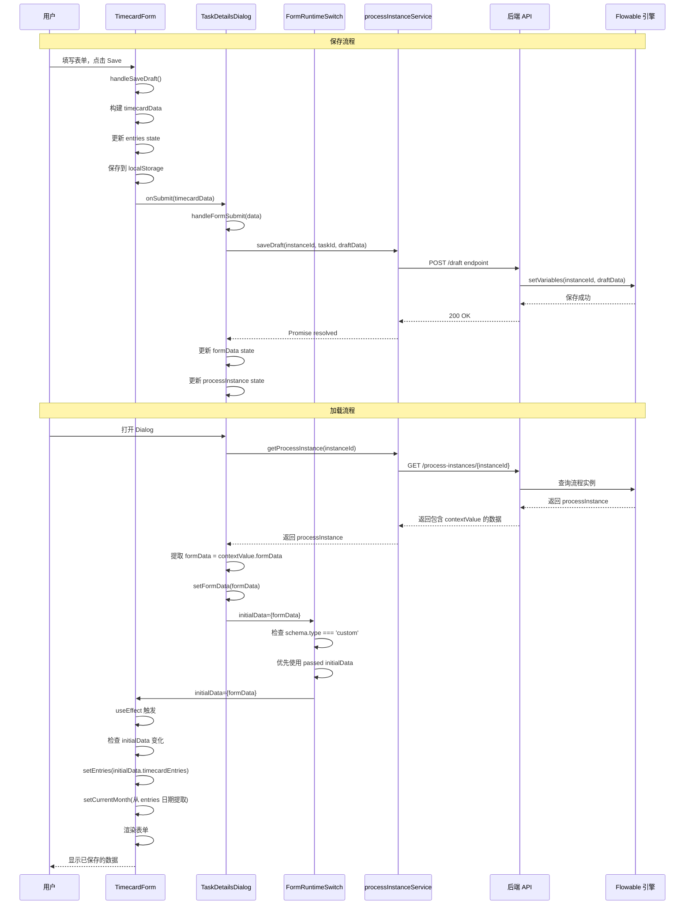
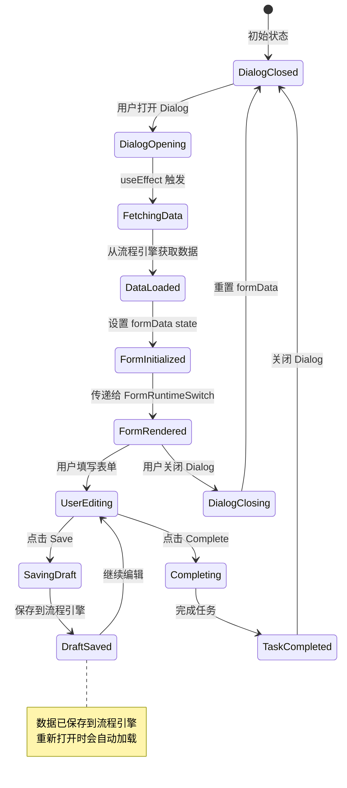

# Timecard 表单数据流向与开发经验总结

## 目录
1. [数据流向图](#数据流向图)
2. [关键组件说明](#关键组件说明)
3. [数据格式定义](#数据格式定义)
4. [开发经验总结](#开发经验总结)
5. [常见问题与解决方案](#常见问题与解决方案)
6. [最佳实践](#最佳实践)

---

## 数据流向图

### 1. 完整数据流（保存与加载）

```mermaid
graph TB
    subgraph "用户操作层"
        A[用户填写 Timecard 表单] --> B[点击 Save Draft 按钮]
        B --> C[点击 Complete 按钮]
    end
    
    subgraph "前端组件层 - TimecardForm"
        B --> D[handleSaveDraft]
        D --> E[构建 timecardData 对象]
        E --> F[更新本地 formData state]
        F --> G[保存到 localStorage]
        G --> H[调用 onSubmit 回调]
    end
    
    subgraph "前端组件层 - TaskDetailsDialog"
        H --> I[handleFormSubmit 接收数据]
        I --> J{检查 task 信息}
        J -->|有 task 信息| K[构建 draftData 对象]
        J -->|无 task 信息| L[仅更新本地 state]
        K --> M[调用 processInstanceService.saveDraft]
        K --> N[更新 formData state]
        K --> O[更新 processInstance state]
    end
    
    subgraph "前端 API 层"
        M --> P[POST /process-instances/{instanceId}/tasks/{taskId}/draft]
    end
    
    subgraph "后端 Controller 层"
        P --> Q[ProcessInstanceControllerV1.saveDraft]
        Q --> R[ProcessInstanceService.saveDraft]
    end
    
    subgraph "后端 Service 层"
        R --> S[验证 task 存在性]
        S --> T[调用 ensureFormDataNotOverwritten]
        T --> U[taskService.setVariables]
        U --> V[runtimeService.setVariables]
        V --> W[保存到 Flowable 流程引擎]
    end
    
    subgraph "数据加载流程"
        X[用户重新打开 Dialog] --> Y[TaskDetailsDialog useEffect 触发]
        Y --> Z[调用 processInstanceService.getProcessInstance]
        Z --> AA[后端返回 processInstance]
        AA --> AB[提取 contextValue.formData]
        AB --> AC[设置 formData state]
        AC --> AD[传递给 FormRuntimeSwitch]
        AD --> AE[传递给 TimecardForm]
        AE --> AF[TimecardForm useEffect 处理]
        AF --> AG[设置 entries state]
        AG --> AH[设置 currentMonth]
        AH --> AI[渲染表单]
    end
    
    style A fill:#e1f5ff
    style W fill:#c8e6c9
    style AI fill:#c8e6c9
```

### 2. 组件间数据传递流程



### 3. 状态管理流程图



---

## 关键组件说明

### 1. TimecardForm.jsx

**职责：**
- 管理 timecard 表单的完整状态（entries, currentMonth, formData）
- 处理用户输入和表单验证
- 提供 Save Draft 功能
- 协调子组件（StaffInfoCard, TimecardSummary, CalendarView, PreviousMonthAdjust）

**关键状态：**
```javascript
const [entries, setEntries] = useState([]);           // 时间卡条目数组
const [currentMonth, setCurrentMonth] = useState(...); // 当前显示的月份
const [formData, setFormData] = useState({});          // 完整的表单数据对象
```

**关键方法：**
- `handleSaveDraft()`: 构建完整的 timecardData 对象，保存到 localStorage，调用 onSubmit
- `handleEntriesUpdate(newEntries)`: 更新 entries 状态
- `useEffect`: 监听 initialData 变化，初始化表单数据

**数据初始化逻辑：**
```javascript
// 优先级：initialData (props) > localStorage > 空对象
// 月份设置优先级：entries 日期 > summary.month > employeeInfo.timecardMonth
```

### 2. TaskDetailsDialog.jsx

**职责：**
- 管理 Dialog 的打开/关闭状态
- 从流程引擎获取和保存数据
- 协调 FormRuntimeSwitch 和流程实例数据

**关键状态：**
```javascript
const [formData, setFormData] = useState({});           // 表单数据
const [processInstance, setProcessInstance] = useState(null); // 流程实例
```

**关键方法：**
- `handleFormSubmit(data)`: 接收表单数据，保存草稿到流程引擎
- `handleComplete()`: 完成任务，传递表单数据
- `useEffect`: 监听 open 和 task 变化，重新加载数据

**数据加载逻辑：**
```javascript
// 当 Dialog 打开时：
// 1. 从流程引擎获取 processInstance
// 2. 提取 contextValue.formData
// 3. 设置 formData state
// 4. 传递给 FormRuntimeSwitch
```

### 3. FormRuntimeSwitch.jsx

**职责：**
- 根据 schema.type 决定渲染自定义组件还是通用表单组件
- 处理 initialData 的优先级

**关键逻辑：**
```javascript
// initialData 优先级：
// 1. 从 props 传入的 initialData (来自 TaskDetailsDialog)
// 2. schema.initialData (schema 中定义的默认值)
```

### 4. CalendarView.jsx

**职责：**
- 显示月历视图
- 处理日期点击和条目显示
- 提供批量复制和删除功能

**关键 Props：**
- `currentMonth`: 当前显示的月份
- `entries`: 时间卡条目数组
- `onEntriesUpdate`: 更新条目的回调函数

---

## 数据格式定义

### 1. TimecardData 完整结构

```javascript
{
  employeeInfo: {
    staffId: string,              // 员工 ID
    staffNameChinese: string,       // 中文名
    staffNameEnglish: string,       // 英文名
    team: string,                  // 团队
    staffType: string,             // 员工类型
    departmentHead: string,        // 部门负责人
    finalApproval: string,         // 最终审批人
    timecardMonth: string          // 时间卡月份 (格式: "YYYY-MM")
  },
  timecardEntries: [               // 时间卡条目数组
    {
      id: string,                  // 唯一 ID (格式: "{date}-{index}-{timestamp}")
      date: string,                // 日期 (格式: "YYYY-MM-DD")
      projectCode: string,         // 项目代码
      projectName: string,          // 项目名称
      taskNumber: string,          // 任务编号
      activity: string,            // 活动类型
      claimType: string,           // 申请类型 (NORMAL/OVERTIME/WEEKEND/HOLIDAY)
      hours: number,               // 小时数
      remark: string              // 备注
    }
  ],
  summary: {
    totalHours: number,            // 总小时数
    totalEntries: number,          // 总条目数
    month: string,                 // 月份 (格式: "YYYY-MM")
    status: string                 // 状态 (DRAFT/SUBMITTED)
  },
  timestamp: string,              // ISO 时间戳
  submited: string                // 是否已提交 ("true"/"false")
}
```

### 2. 流程引擎变量结构

```javascript
{
  formData: {
    // 完整的 TimecardData 对象
    employeeInfo: {...},
    timecardEntries: [...],
    summary: {...},
    timestamp: "...",
    submited: "false"
  },
  approve: string,                // 审批结果 ("approve"/"reject")
  initiator: string,               // 发起人
  rejectionReason: string | null   // 拒绝原因（如果有）
}
```

### 3. DraftData 结构（保存草稿时）

```javascript
{
  formData: {
    // TimecardData 对象
  },
  submited: "false"               // 标记为草稿
}
```

---

## 开发经验总结

### 1. React State 管理最佳实践

#### 问题：useEffect 依赖导致无限循环或更新丢失

**解决方案：**
```javascript
// ❌ 错误做法：直接使用对象作为依赖
useEffect(() => {
  // ...
}, [initialData]); // 对象引用变化会导致无限循环

// ✅ 正确做法：使用 useMemo 和 JSON.stringify 进行深度比较
const initialDataKey = useMemo(() => {
  return JSON.stringify(initialData);
}, [initialData]);

useEffect(() => {
  const currentKey = JSON.stringify(initialData);
  const prevKey = prevInitialDataRef.current;
  
  // 只有当数据真正变化时才更新
  if (prevKey !== null && currentKey === prevKey && Object.keys(formData).length > 0) {
    return; // 跳过更新
  }
  
  prevInitialDataRef.current = currentKey;
  // 更新逻辑...
}, [initialDataKey]);
```

**关键点：**
- 使用 `useRef` 保存上一次的值，避免不必要的更新
- 使用 `JSON.stringify` 进行深度比较
- 检查 `formData` 是否为空，确保首次加载时能正确初始化

#### 问题：组件重新渲染时状态丢失

**解决方案：**
```javascript
// 使用 key prop 强制重新渲染
<FormRuntimeSwitch
  key={`form-${task?.taskId}-${open}`}
  schema={parsedSchema}
  initialData={formData}
  onSubmit={handleFormSubmit}
/>
```

**关键点：**
- 当 Dialog 打开或 task 变化时，key 变化会强制组件完全重新创建
- 确保组件使用最新的 props 初始化

### 2. 数据流设计原则

#### 原则 1：单一数据源（Single Source of Truth）

**实现：**
- 流程引擎是数据的唯一真实来源
- localStorage 仅作为临时缓存，不依赖它作为主要数据源
- 组件 state 仅用于 UI 渲染，不持久化

**好处：**
- 避免数据不一致
- 多设备同步更容易
- 数据恢复更可靠

#### 原则 2：数据向下流动（Data Flows Down）

**实现：**
```javascript
// 数据流向：流程引擎 → TaskDetailsDialog → FormRuntimeSwitch → TimecardForm
TaskDetailsDialog (formData) 
  → FormRuntimeSwitch (initialData)
    → TimecardForm (initialData)
      → CalendarView (entries)
```

**好处：**
- 数据流清晰，易于追踪
- 组件职责明确
- 调试更容易

#### 原则 3：事件向上冒泡（Events Bubble Up）

**实现：**
```javascript
// 事件流向：TimecardForm → TaskDetailsDialog → 流程引擎
TimecardForm (onSubmit)
  → TaskDetailsDialog (handleFormSubmit)
    → processInstanceService.saveDraft
      → 后端 API
        → 流程引擎
```

**好处：**
- 父组件控制数据保存逻辑
- 子组件专注于 UI 和用户交互
- 便于统一处理错误和加载状态

### 3. 异步操作处理

#### 问题：异步操作时序问题

**解决方案：**
```javascript
const handleFormSubmit = async (data) => {
  try {
    // 1. 先保存到后端
    await processInstanceService.saveDraft(instanceId, taskId, draftData);
    
    // 2. 保存成功后再更新本地 state
    setFormData(data);
    
    // 3. 同步更新 processInstance state
    if (processInstance) {
      setProcessInstance({
        ...processInstance,
        contextValue: {
          ...processInstance.contextValue,
          formData: data
        }
      });
    }
  } catch (error) {
    // 错误处理：即使保存失败，也更新本地 state（离线支持）
    console.error('Error saving draft:', error);
    setFormData(data);
  }
};
```

**关键点：**
- 使用 async/await 确保操作顺序
- 错误处理要考虑用户体验（离线支持）
- 更新多个相关 state 时要保持一致性

### 4. 月份处理逻辑

#### 问题：月份不一致导致数据不显示

**原因：**
- `summary.month` 可能是错误的月份
- 应该从 `entries` 的日期中提取月份

**解决方案：**
```javascript
// ✅ 正确做法：优先从 entries 日期中提取月份
if (initialData.timecardEntries && initialData.timecardEntries.length > 0) {
  const firstEntryDate = initialData.timecardEntries[0].date;
  const [year, month] = firstEntryDate.split('-');
  const newMonth = new Date(parseInt(year), parseInt(month) - 1, 1);
  setCurrentMonth(newMonth);
}
// 只有当没有 entries 时才使用 summary.month
else if (initialData.summary?.month) {
  // ...
}
```

**关键点：**
- 数据驱动的月份设置，而不是依赖可能错误的元数据
- 确保日历显示正确的月份，条目才能正确显示

### 5. 组件重新渲染优化

#### 问题：数据更新但 UI 不更新

**解决方案：**
```javascript
// 1. 使用 key prop 强制重新渲染
<CalendarView
  key={`calendar-${currentMonth.getTime()}-${entries.length}`}
  currentMonth={currentMonth}
  entries={entries}
  // ...
/>

// 2. 在子组件中添加 useEffect 监听 props 变化
React.useEffect(() => {
  console.log('CalendarView: Component rendered');
  console.log('Entries:', entries);
}, [currentMonth, entries]);
```

**关键点：**
- key prop 是 React 识别组件是否需要重新创建的关键
- useEffect 可以帮助调试和追踪数据变化

---

## 常见问题与解决方案

### 问题 1：表单数据保存后重新打开看不到

**症状：**
- 点击 Save 后，console 显示数据已保存
- 关闭 Dialog 再打开，表单是空的

**原因：**
- `handleFormSubmit` 只更新了本地 state，没有保存到流程引擎
- Dialog 重新打开时从流程引擎读取，但流程引擎中没有新数据

**解决方案：**
1. 在 `handleFormSubmit` 中调用 `saveDraft` API
2. 确保数据保存到流程引擎的变量中
3. Dialog 重新打开时从流程引擎读取数据

**代码：**
```javascript
const handleFormSubmit = async (data) => {
  await processInstanceService.saveDraft(instanceId, taskId, {
    formData: data,
    submited: "false"
  });
  setFormData(data);
};
```

### 问题 2：useEffect 不触发或触发太频繁

**症状：**
- 数据变化但组件不更新
- 或者组件不断重新渲染

**原因：**
- 对象引用变化但内容没变
- 或者依赖项设置不正确

**解决方案：**
```javascript
// 使用 useMemo 和 useRef 进行深度比较
const prevInitialDataRef = useRef(null);
const initialDataKey = useMemo(() => {
  return JSON.stringify(initialData);
}, [initialData]);

useEffect(() => {
  const currentKey = JSON.stringify(initialData);
  const prevKey = prevInitialDataRef.current;
  
  if (prevKey !== null && currentKey === prevKey && Object.keys(formData).length > 0) {
    return; // 跳过更新
  }
  
  prevInitialDataRef.current = currentKey;
  // 更新逻辑...
}, [initialDataKey]);
```

### 问题 3：月份显示错误，条目不显示

**症状：**
- 日历显示错误的月份
- 条目存在但不显示在日历中

**原因：**
- `currentMonth` 设置错误
- 使用了 `summary.month` 而不是从 entries 日期中提取

**解决方案：**
```javascript
// 优先从 entries 日期中提取月份
if (initialData.timecardEntries && initialData.timecardEntries.length > 0) {
  const firstEntryDate = initialData.timecardEntries[0].date;
  const [year, month] = firstEntryDate.split('-');
  setCurrentMonth(new Date(parseInt(year), parseInt(month) - 1, 1));
}
```

### 问题 4：Dialog 重新打开时数据不加载

**症状：**
- Dialog 关闭后再打开，数据丢失

**原因：**
- `useEffect` 依赖项缺少 `open`
- Dialog 关闭时清空了 `formData`

**解决方案：**
```javascript
useEffect(() => {
  if (!open || !task?.processInstanceId) {
    if (!open) {
      setFormData({}); // 关闭时清空
    }
    return;
  }
  
  // 打开时重新加载数据
  fetchProcessInstance();
}, [open, task, t]); // 确保 open 在依赖项中
```

### 问题 5：initialData 优先级错误

**症状：**
- schema 中的 `initialData` 覆盖了从流程引擎加载的数据

**原因：**
- `FormRuntimeSwitch` 中 `initialData` 优先级设置错误

**解决方案：**
```javascript
// FormRuntimeSwitch.jsx
const finalInitialData = initialData && Object.keys(initialData).length > 0
  ? initialData  // 优先使用传入的 initialData
  : (schema.initialData || {}); // 回退到 schema.initialData
```

---

## 最佳实践

### 1. 数据持久化策略

**三层存储：**
1. **流程引擎（主要）**：真实数据源，持久化到数据库
2. **localStorage（缓存）**：临时存储，提升用户体验
3. **组件 State（临时）**：仅用于 UI 渲染

**使用场景：**
- 保存草稿：保存到流程引擎 + localStorage
- 加载数据：优先从流程引擎加载，localStorage 作为备用
- 离线支持：localStorage 提供基本的离线功能

### 2. 错误处理策略

**分层错误处理：**
```javascript
try {
  // 1. 尝试保存到流程引擎
  await processInstanceService.saveDraft(...);
  // 2. 成功：更新所有相关 state
  setFormData(data);
} catch (error) {
  // 3. 失败：仍然更新本地 state（离线支持）
  console.error('Save failed:', error);
  setFormData(data); // 用户可以看到他们的输入
  // 4. 显示错误提示
  toast.error('保存失败，但数据已保存在本地');
}
```

### 3. 调试技巧

**添加详细的 console.log：**
```javascript
console.log('=== ComponentName: Action ===');
console.log('Input:', input);
console.log('State before:', state);
// ... 操作 ...
console.log('State after:', state);
```

**使用 key prop 追踪重新渲染：**
```javascript
<Component key={`${id}-${timestamp}`} />
```

**使用 React DevTools：**
- 检查组件 props 和 state
- 追踪数据流
- 识别不必要的重新渲染

### 4. 性能优化

**避免不必要的重新渲染：**
- 使用 `useMemo` 缓存计算结果
- 使用 `useCallback` 缓存函数
- 使用 `React.memo` 包装纯组件

**优化数据比较：**
- 使用 `JSON.stringify` 进行深度比较
- 使用 `useRef` 保存上一次的值

**懒加载和代码分割：**
- 大型组件使用 `React.lazy`
- 路由级别的代码分割

### 5. 代码组织

**组件职责分离：**
- `TimecardForm`：表单逻辑和状态管理
- `TaskDetailsDialog`：Dialog 管理和数据加载
- `FormRuntimeSwitch`：组件路由
- `CalendarView`：UI 展示

**数据格式统一：**
- 定义清晰的数据结构
- 使用 TypeScript 或 JSDoc 类型注释
- 数据验证和转换集中处理

**错误处理集中化：**
- 统一的错误处理函数
- 错误消息国际化
- 用户友好的错误提示

---

## 总结

### 核心要点

1. **数据流清晰**：流程引擎 → Dialog → Form → 子组件
2. **状态管理合理**：使用 useRef 和深度比较避免不必要的更新
3. **数据持久化**：保存到流程引擎，localStorage 作为缓存
4. **错误处理完善**：考虑离线场景和用户体验
5. **调试充分**：详细的日志和 key prop 追踪

### 关键学习

1. **React useEffect 依赖管理**：使用 useMemo 和 useRef 进行深度比较
2. **组件重新渲染控制**：使用 key prop 和 useEffect 监听
3. **异步操作处理**：使用 async/await 确保操作顺序
4. **数据优先级**：明确数据来源的优先级
5. **错误恢复**：即使保存失败也要更新本地 state

### 未来改进方向

1. **TypeScript 迁移**：提供类型安全
2. **状态管理库**：考虑使用 Redux 或 Zustand 管理复杂状态
3. **数据验证**：添加更严格的数据验证
4. **离线支持**：完善离线功能，使用 Service Worker
5. **性能监控**：添加性能监控和错误追踪

---

**文档版本：** 1.0  
**最后更新：** 2025-01-13  
**作者：** AI Assistant  
**审核状态：** 待审核

